# EffectEditor 설명서

이 문서는 EffectEditor를 실제로 사용할 때 필요한 화면 구성, 작성 흐름, Emitter, TypeData, Module, Material 편집, Curve Editor, Preview 경계를 설명한다. 즉, 에디터 안에서 무엇을 보고 어떤 값을 조작해야 하는지 이해하기 위한 사용자 설명서다.

문서의 용어는 에디터 UI에 보이는 이름을 우선한다. 예를 들어 `타입 데이터`, `새 모듈`, `추가 가능`, `이미 장착됨`, `현재 TypeData와 비호환` 같은 문구는 UI 표기를 그대로 따른다. 다만 코드와 저장 데이터의 개념을 구분해야 하는 곳에서는 `Emitter`, `TypeData`, `Module`, `Detail View`, `Curve Editor`, `Restart Preview`처럼 에디터 내부에서 쓰는 영문 용어를 함께 사용한다.

## 1. 개요

EffectEditor는 하나의 effect asset을 여러 Emitter로 나누고, 각 Emitter에 TypeData와 Module을 붙여 동작을 구성하는 authoring tool이다.

기본 구조는 다음과 같다.

- **Emitter**: 하나의 방출 단위다. 입자, mesh, trail, ribbon, beam 같은 효과 단위를 구성한다.
- **TypeData**: Emitter가 단순 particle인지, 메시 데이터/트레일 데이터/리본 데이터/빔 데이터를 갖는 특수 타입인지 결정한다.
- **Module**: Emitter의 세부 동작을 추가하는 기능 단위다. 예를 들어 `스폰`, `수명`, `초기 위치`, `수명에 따른 색상`, `머티리얼 변조`가 Module이다.
- **Detail View**: 현재 선택한 Emitter, TypeData, Module의 값을 편집하는 창이다.
- **Scene View**: 현재 authoring 상태를 preview runtime으로 재생해서 보는 창이다.
- **Curve Editor**: Module 값 중 시간에 따라 변하는 curve를 편집하는 창이다.

중요한 경계가 하나 있다. EffectEditor에서 보이는 모든 상태가 저장되는 effect asset은 아니다. Emitter, TypeData, Module payload, Material authoring data는 저장 대상이지만, viewport overlay, Trail preview object, Preview Plane, debug render helper는 에디터에서 관측을 돕기 위한 상태다.

## 2. 화면 구성

EffectEditor는 여러 창을 동시에 보면서 작업하는 방식이다. 처음에는 전체 구조를 먼저 익히고, 이후 Emitter와 Module의 세부 값을 편집하는 흐름으로 접근하는 것이 좋다.

### 2.1 Runtime Toolbar

Runtime Toolbar는 effect 파일 조작과 preview 재생을 다루는 상단 영역이다.

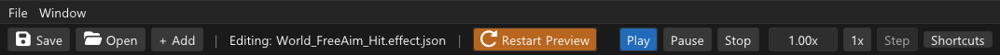

주요 기능은 다음과 같다.

- **Save / Open**: 현재 effect authoring data를 저장하거나 기존 effect 파일을 연다.
- **Add**: 다른 effect 파일을 열어 그 안의 Emitter들을 현재 effect에 가져와 붙인다. 새 빈 Emitter를 만드는 기능이 아니라, 기존 effect의 Emitter stack을 합치는 import 기능이다.
- **Restart Preview**: 현재 authoring data를 기준으로 preview object를 다시 구성한다.
- **Play / Pause / Stop / Step**: preview runtime의 시간 진행을 조작한다.

`Play`는 preview runtime을 계속 진행한다. `Pause`는 현재 상태에서 시간을 멈춘다. `Step`은 멈춘 상태에서 한 tick만 진행해 타이밍을 확인할 때 사용한다. `Stop` 또는 edit 상태에서는 runtime delta가 0에 가까운 편집 상태로 돌아간다고 이해하면 된다.

### 2.2 Scene View

Scene View는 현재 effect를 실제 preview runtime으로 확인하는 viewport다.

Scene View에서 확인할 수 있는 것은 다음과 같다.

- effect의 크기와 위치감.
- particle, mesh, trail, ribbon, beam의 움직임.
- Material, texture, color, alpha 변화.
- Play/Pause/Step 상태에 따른 시간 변화.
- Trail Preview, Preview Plane, debug render 같은 editor-only helper 표시.

Scene View는 작성 중인 effect를 판단하는 가장 중요한 창이지만, 여기 보이는 것이 전부 저장 데이터라는 뜻은 아니다. 특히 Trail preview object나 Preview Plane은 saved effect asset에 포함되지 않는다.

### 2.3 Emitter View

Emitter View는 effect를 구성하는 Emitter와 Module stack을 편집하는 창이다.

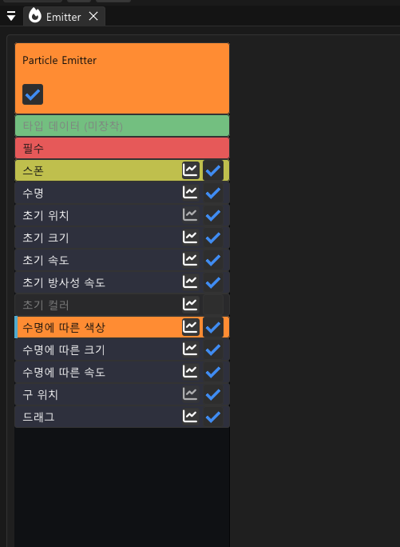

각 column은 하나의 Emitter를 나타낸다. column 상단에는 Emitter header가 있고, 그 아래에는 `타입 데이터` row와 Module row들이 쌓인다.

Emitter View에서 주로 하는 작업은 다음과 같다.

- 새 Emitter 추가.
- Emitter 선택.
- `타입 데이터` 추가/초기화/제거.
- `새 모듈` 메뉴를 통해 Module 추가.
- Module 선택, 활성/비활성 전환.
- Emitter나 Module을 복사/붙여넣기.

새 Emitter, TypeData, Module 추가는 Emitter View의 우클릭 메뉴에서 진입한다. Emitter column의 header나 빈 tail 영역을 우클릭하면 Emitter 단위 메뉴가 열리고, 여기서 `파티클 시스템`, `타입 데이터`, `모듈` 하위 메뉴를 사용할 수 있다. `타입 데이터` row를 우클릭하면 TypeData 추가/초기화/제거 메뉴가 바로 열리고, `모듈 > 새 모듈`을 선택하면 Module picker가 열린다.

복사/붙여넣기는 선택한 row에 따라 의미가 다르다. Emitter header에서는 Emitter 단위 붙여넣기를 사용하고, Module row에서는 `모듈 붙여넣기`와 `값 붙여넣기`를 구분한다. `모듈 붙여넣기`는 새 Module row를 추가하는 동작이고, `값 붙여넣기`는 같은 타입 Module의 payload를 현재 row에 덮어쓰는 동작이다.

새 Emitter는 비어 있는 board 영역이나 Emitter View의 관련 메뉴에서 추가한다.

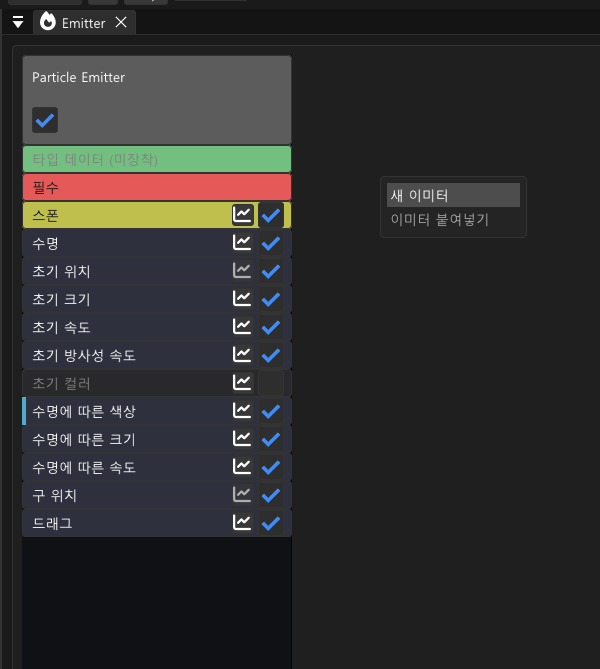

### 2.4 Detail View

Detail View는 현재 선택한 대상의 세부 값을 편집하는 창이다.

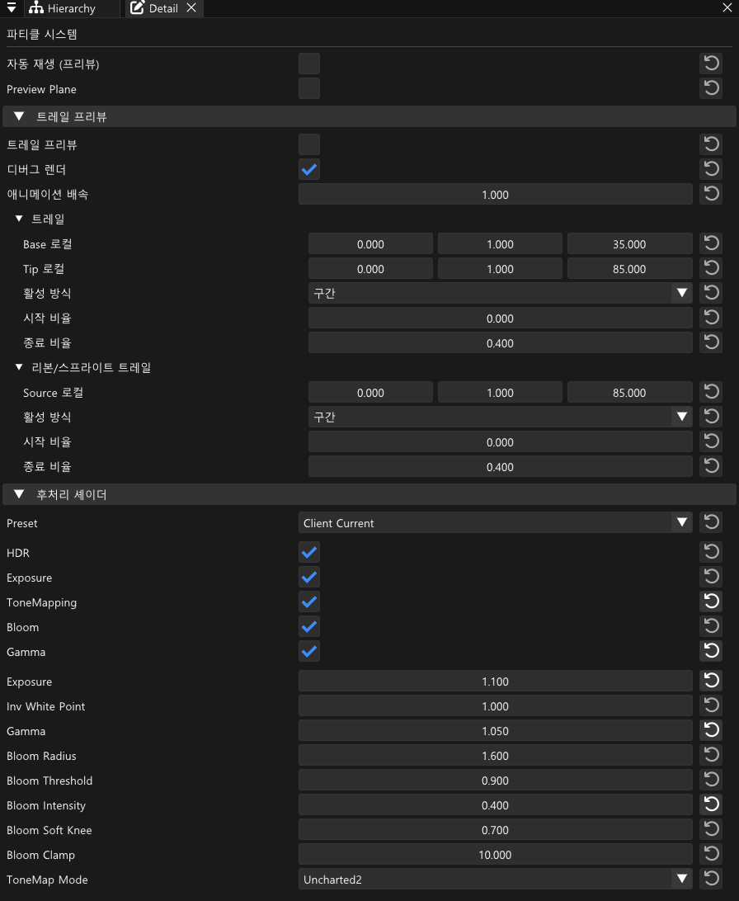

선택 대상에 따라 Detail View의 내용은 달라진다.

- Emitter를 선택하면 Emitter 단위 설정을 편집한다.
- `타입 데이터` row를 선택하면 Trail/Mesh/Ribbon/Beam 같은 TypeData 값을 편집한다.
- Module row를 선택하면 해당 Module payload를 편집한다.
- 선택 대상이 없으면 default 상태를 표시한다.

Detail View는 저장 schema 자체를 새로 정의하는 곳이 아니라, 이미 선택된 authoring payload를 편집하는 UI다. Module별 row UI는 Module type에 따라 달라지고, 공통 property table, reset 버튼, distribution row는 같은 편집 규칙을 공유한다.

### 2.5 Curve Editor

Curve Editor는 Module 값 중 시간에 따라 변하는 curve를 편집하는 창이다.

Curve Editor는 단독으로 아무 curve나 여는 창이 아니다. Emitter View나 Detail View에서 curve 편집 대상으로 지정된 값이 있을 때, 해당 track을 기준으로 graph를 보여준다. Curve가 비어 있거나 선택되지 않은 경우에는 먼저 Emitter 창의 Module curve 버튼으로 편집할 curve를 고정해야 한다.

### 2.6 보조 창

EffectEditor에는 기본 창 외에도 특정 데이터를 더 자세히 편집하기 위한 보조 창이 있다.

- **Material Instance View**: Required Module이나 MeshData가 들고 있는 embedded material instance 값을 편집한다.
- **Mesh Data Preview**: Mesh TypeData의 model asset, assigned material, 내부 material copy 상태를 확인한다.
- **Color Picker popup**: color field를 직접 선택한다.
- **Trail preview helper**: Trail sample을 만들 preview object와 Preview Plane을 표시한다.

보조 창은 대부분 특정 Emitter나 Module의 데이터를 더 보기 좋게 편집하기 위한 view다. 저장 정본이 창 자체로 이동하는 것은 아니며, 실제 저장 대상은 Emitter/TypeData/Module payload에 남는다.

## 3. 기본 편집 흐름

Effect 작성은 보통 다음 순서로 진행한다.

1. Effect 파일을 새로 만들거나 기존 effect를 연다.
2. Emitter를 추가한다.
3. 필요한 경우 `타입 데이터`를 추가한다.
4. Module을 추가한다.
5. Module을 선택하고 Detail View에서 값을 편집한다.
6. Scene View에서 preview를 확인한다.
7. 구조나 preview object가 바뀐 경우 Restart Preview를 누른다.
8. 결과를 저장한다.

### 3.1 Effect 생성 또는 열기

Save/Open은 일반적인 파일 저장/열기 흐름을 사용한다. 파일 대화상자 자체는 Windows 기본 UI에 가깝기 때문에, EffectEditor에서 더 중요하게 볼 것은 열린 뒤의 Emitter/TypeData/Module 상태다.

기존 effect를 열 때는 저장되지 않은 변경 사항이 사라질 수 있다. 열기 전에 현재 작업을 저장해야 하는지 먼저 확인한다.

Save/Open 옆의 `Add`는 선택한 effect 파일의 Emitter들을 현재 effect 뒤에 import한다. 여러 effect에서 이미 만든 Emitter 구성을 재사용하거나 합칠 때 쓰며, 현재 문서를 완전히 교체하는 Open과 다르다. 새로 비어 있는 Emitter 하나를 만들고 싶다면 `Add`가 아니라 Emitter View의 우클릭 메뉴에서 새 Emitter를 추가한다.

### 3.2 Emitter 추가

새 Emitter를 추가하면 Emitter View에 새로운 column이 생긴다. Emitter는 effect 안에서 독립적인 방출 단위이므로, 서로 다른 시각 요소를 분리하고 싶을 때 Emitter를 나누는 것이 좋다.

Emitter View에서는 기존 Emitter column의 header나 column 아래 빈 영역을 우클릭한 뒤 `파티클 시스템` 메뉴에서 `앞에 새 이미터 추가` 또는 `뒤에 새 이미터 추가`를 선택한다. board의 빈 영역에서도 새 Emitter 메뉴로 진입할 수 있다.

예를 들어 하나의 폭발 효과라도 중심 flash, 바깥 ring, 잔광 particle, 후속 trail을 각각 다른 Emitter로 나눌 수 있다. 반대로 같은 texture와 같은 lifetime 규칙을 공유하는 단순 변화라면 하나의 Emitter 안에서 Module 조합으로 해결할 수 있다.

### 3.3 TypeData 선택

Emitter column 안의 `타입 데이터` row는 Emitter가 특수 타입 데이터를 갖는지 보여준다.

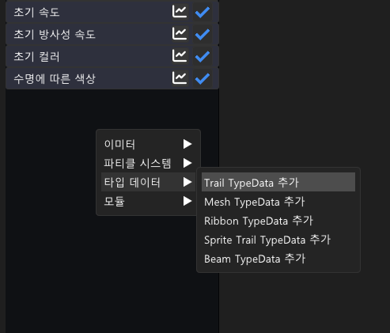

TypeData가 없는 상태는 UI에서 `타입 데이터 (미장착)`으로 표시된다. 이 상태는 기본 particle-style Emitter로 이해하면 된다.

TypeData를 추가하려면 Emitter header를 우클릭한 뒤 `타입 데이터` 메뉴로 들어가거나, Emitter column 안의 `타입 데이터` row를 직접 우클릭한다. 이미 TypeData가 붙은 상태에서는 같은 메뉴에서 값 초기화나 제거를 선택할 수 있다.

타입 데이터 메뉴에서는 다음 타입을 추가할 수 있다.

- `Trail TypeData 추가`: `트레일 데이터` row를 만든다.
- `Mesh TypeData 추가`: `메시 데이터` row를 만든다.
- `Ribbon TypeData 추가`: `리본 데이터` row를 만든다.
- `Sprite Trail TypeData 추가`: `스프라이트 트레일 데이터` row를 만든다.
- `Beam TypeData 추가`: `빔 데이터` row를 만든다.
- `타입 데이터 값 초기화`: 현재 TypeData payload를 기본값으로 되돌린다.
- `타입 데이터 제거`: TypeData를 제거하고 기본 particle-style Emitter로 되돌린다.

TypeData는 단순히 UI 표시만 바꾸는 값이 아니다. Emitter가 preview/runtime으로 낮아질 때 어떤 emitter desc로 변환되는지, 어떤 Module이 의미 있게 소비되는지에 영향을 준다.

### 3.4 Module 추가

`새 모듈` 창은 현재 Emitter에 붙일 수 있는 Module을 보여준다.

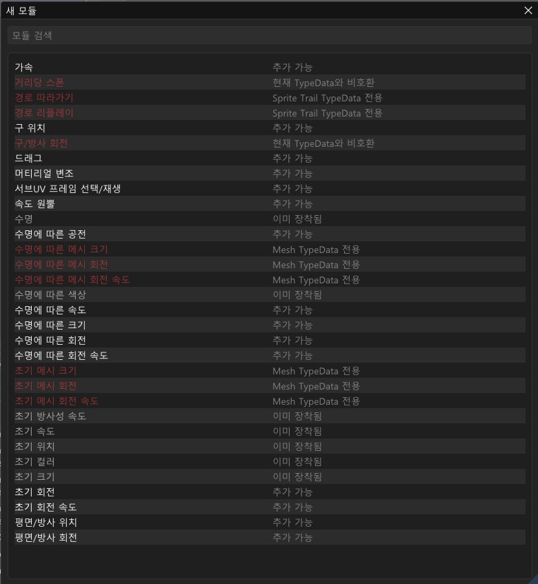

Module을 추가하려면 Emitter header나 column의 빈 tail 영역을 우클릭한 뒤 `모듈 > 새 모듈`을 선택한다. 이때 열린 Module picker는 우클릭한 Emitter를 대상으로 하므로, 여러 Emitter가 있을 때는 어느 column에서 메뉴를 열었는지 먼저 확인한다.

Module picker에는 이름과 상태가 함께 표시된다.

| 상태 | 의미 |
| --- | --- |
| `추가 가능` | 현재 Emitter에 추가할 수 있다. |
| `이미 장착됨` | 같은 타입의 Module이 이미 Emitter에 있다. |
| `현재 TypeData와 비호환` | 현재 TypeData에서는 preview/runtime 입력으로 소비되지 않는다. Mesh 전용 Module처럼 사유가 명확한 경우 `Mesh TypeData 전용` 같은 구체 문구로 표시될 수 있다. |
| `미구현` | UI에 후보는 있지만 아직 실제 추가 대상으로 열지 않은 상태다. |

Module을 추가할 수 없을 때는 먼저 이 상태 문구를 확인한다. 무조건 버그로 보기 전에, 현재 TypeData와 Module이 맞는 조합인지 확인하는 것이 빠르다.

### 3.5 Module Detail 편집

Module을 선택하면 Detail View에 해당 Module의 세부 값이 나타난다. 값 편집은 대부분 다음 형태 중 하나다.

- 숫자 입력.
- Vec2/Vec3 입력.
- Color 입력.
- checkbox.
- combo box.
- distribution 선택.
- curve key 편집.
- reset 버튼.

Reset 버튼은 해당 field를 기본값으로 되돌릴 때 사용한다. Reset은 전체 Module을 지우는 기능이 아니라, 선택한 값 또는 row를 default로 돌리는 조작이다.

### 3.6 Preview 확인

값을 수정하면 일부는 즉시 Scene View에서 확인할 수 있다. 그러나 Emitter 구조, TypeData, runtime desc 구성이 바뀌는 값은 Restart Preview를 눌러 preview object를 다시 만들어야 명확히 반영될 수 있다.

Preview가 예상과 다르면 다음 순서로 확인한다.

1. Emitter와 Module이 enabled 상태인지 확인한다.
2. Spawn/Lifetime 값이 실제로 보이는 범위인지 확인한다.
3. Texture/Material이 지정되어 있는지 확인한다.
4. 필요한 경우 Restart Preview를 누른다.
5. TypeData와 Module 호환성을 확인한다.

### 3.7 Effect 저장

Save는 현재 authoring data를 `.effect.json` 계열 asset으로 저장한다. 저장 대상에는 Emitter, TypeData, Module payload, Material authoring data가 포함된다.

다음 상태는 저장되는 effect data로 보지 않는다.

- 창 배치와 dock layout.
- Scene View overlay.
- Trail preview object 표시.
- Preview Plane 표시.
- debug render helper.

## 4. Emitters

Emitter는 effect를 구성하는 가장 큰 authoring 단위다. 하나의 Emitter는 하나의 시각 요소 또는 한 계열의 방출 동작을 담당한다고 보면 된다.

### 4.1 Emitter가 소유하는 것

Emitter는 다음 정보를 묶는다.

- Emitter 이름과 id.
- enabled 상태.
- TypeData.
- Module stack.
- Required Module의 resource/material 요약.
- source reference가 필요한 경우 참조 대상.

Emitter는 Module의 단순 묶음만이 아니다. TypeData가 붙으면 같은 Module도 다른 방식으로 해석될 수 있다. 예를 들어 `수명에 따른 크기`는 Sprite, Trail, Ribbon, Beam에서 대체로 폭이나 크기 변화로 읽히지만, Mesh에서는 별도의 mesh size 계열 Module을 쓰는 것이 더 명확하다.

### 4.2 Emitter Header

Emitter Header는 Emitter column의 상단 영역이다. 여기서는 Emitter의 이름, 활성 상태, 주요 resource 요약을 빠르게 확인한다.

Header를 선택하면 Emitter 단위 선택으로 바뀌고, Module row를 선택하면 Module 단위 선택으로 바뀐다. 어떤 값을 편집하고 있는지 헷갈릴 때는 먼저 Emitter View의 선택 row와 Detail View 제목을 함께 확인한다.

### 4.3 Module Stack

Module Stack은 Emitter에 붙은 Module 목록이다.

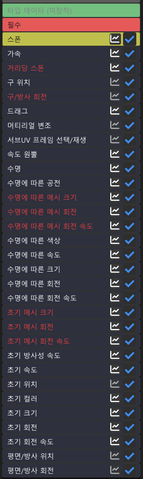

Module row는 대체로 다음 정보를 보여준다.

- Module 표시 이름.
- enabled 상태.
- 선택 상태.
- TypeData에 따라 의미 있는지 여부.

Module 순서는 읽기와 관리 측면에서 중요하다. 실제 runtime 소비 순서는 Module type별 lowering에서 정해질 수 있지만, authoring 관점에서는 `필수`, `스폰`, `수명`, `초기`, `수명에 따른`, `머티리얼` 계열이 한 Emitter 안에 모여 있는 형태로 보는 것이 가장 이해하기 쉽다.

### 4.4 Enabled / Disabled 상태

Emitter나 Module이 disabled 상태이면 값을 가지고 있어도 preview에서 보이지 않거나 동작하지 않을 수 있다. effect가 보이지 않을 때는 Material이나 shader 문제를 먼저 의심하기보다, Emitter enabled와 Module enabled를 먼저 확인하는 편이 빠르다.

`필수`나 `스폰`처럼 구조상 항상 필요한 Module은 일반 optional Module과 다르게 취급될 수 있다. 반면 대부분의 optional Module은 켜고 끄며 시각 차이를 비교할 수 있다.

### 4.5 여러 Emitter와 Source Reference

여러 Emitter를 사용하는 effect에서는 어떤 Emitter가 source 역할을 하는지 중요해질 수 있다. 대표적으로 `리본 데이터(Source History Ribbon)`는 자기 root history를 사용하거나, 같은 effect 안의 다른 particle emitter를 source로 삼을 수 있다.

Source reference를 쓰는 경우에는 다음을 확인한다.

- source로 선택한 Emitter가 같은 effect 안에 있는지.
- source Emitter가 runtime에서 실제 위치 history를 제공할 수 있는 타입인지.
- source Emitter가 disabled 상태는 아닌지.
- source id가 저장/로드 후에도 유지되는지.

## 5. TypeData

TypeData는 Emitter의 타입별 payload다. UI에서는 Emitter column의 `타입 데이터` row로 표시된다.

### 5.1 TypeData 개념

TypeData가 없는 Emitter는 기본 particle-style Emitter다. 그러나 모든 effect를 particle module만으로 설명하기는 어렵다. Mesh는 model asset과 material slot이 필요하고, Trail은 motion sample과 width/history 설정이 필요하며, Ribbon과 Beam은 strip path를 구성하는 별도 입력이 필요하다.

TypeData는 이 타입별 입력을 담는다. 따라서 TypeData를 바꾸면 다음이 함께 달라진다.

- Detail View에 표시되는 타입별 field.
- Module picker의 호환성.
- Preview lowering 방식.
- 저장되는 `.effect.json` payload.
- Client runtime loader가 읽는 emitter desc 계열.

### 5.2 Sprite 또는 TypeData 미장착

`타입 데이터 (미장착)` 상태는 기본 particle-style Emitter다. 주로 다음 Module 조합으로 효과를 만든다.

- `스폰`.
- `수명`.
- `초기 위치`, `구 위치`, `평면/방사 위치`, `실린더 위치`.
- `초기 속도`, `초기 방사성 속도`, `속도 원뿔`.
- `초기 크기`, `수명에 따른 크기`.
- `초기 컬러`, `수명에 따른 색상`.
- `서브UV 프레임 선택/재생`.
- `머티리얼 변조`.

가장 일반적인 particle effect는 이 상태에서 시작하면 된다.

### 5.3 메시 데이터

`메시 데이터`는 mesh 기반 effect를 만들 때 사용한다.

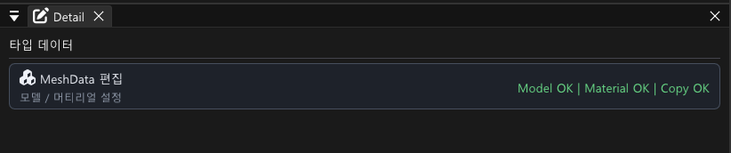

Mesh TypeData 자체는 Emitter가 mesh renderer 계열로 해석되도록 하는 타입별 payload다. 실제 model asset, assigned material, 내부 material copy 검사는 `Mesh Data Preview`에서 더 자세히 다룬다.

Mesh에서 특히 중요한 Module은 다음과 같다.

- `초기 메시 크기`.
- `초기 메시 회전`.
- `초기 메시 회전 속도`.
- `수명에 따른 메시 크기`.
- `수명에 따른 메시 회전`.
- `수명에 따른 메시 회전 속도`.

Sprite용 `초기 크기`나 `수명에 따른 크기`가 있다고 해서 Mesh 크기 조절까지 같은 의미로 보장되는 것은 아니다. Mesh TypeData에서는 mesh 전용 Module을 우선 확인한다.

### 5.4 트레일 데이터

`트레일 데이터`는 움직임 sample을 기반으로 trail strip을 만들 때 사용한다.

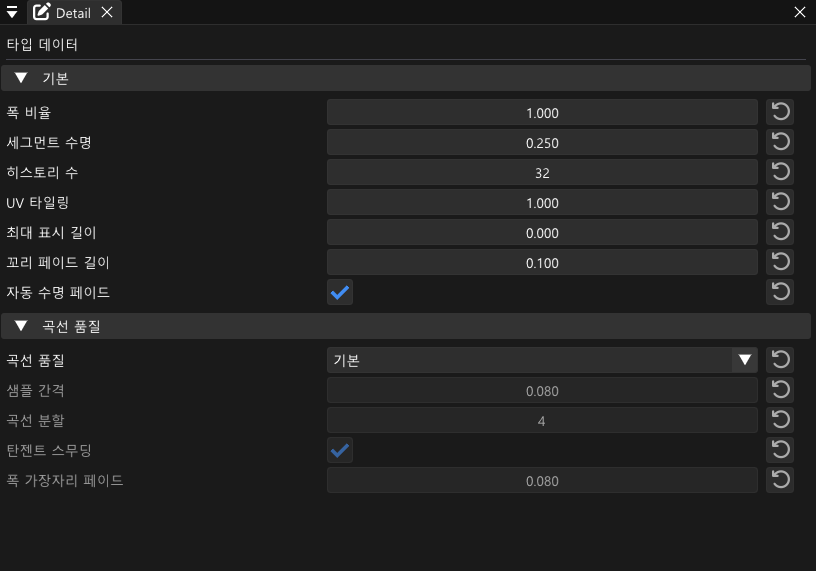

Trail은 한 번 spawn된 particle을 화면에 흩뿌리는 방식보다, 움직이는 source의 base/tip sample이 시간에 따라 쌓이는 방식을 이해하는 것이 중요하다. 따라서 Trail을 편집할 때는 TypeData 값, `거리당 스폰`, Trail preview helper를 함께 봐야 한다.

Trail 작업에서 자주 확인하는 항목은 다음과 같다.

- Trail 길이와 fade 관련 값.
- curve quality preset.
- width/lifetime 관련 값.
- `거리당 스폰`의 sample 삽입 밀도.
- Preview Object의 base/tip local offset.
- Preview Plane을 통한 scale 확인.

Preview helper는 Trail을 관측하기 위한 에디터 장치다. 저장된 effect asset이 실제 gameplay에서 preview object를 소유한다는 뜻은 아니다.

### 5.5 리본 데이터(Source History Ribbon)

`리본 데이터`는 source history를 따라 ribbon strip을 만드는 TypeData다.

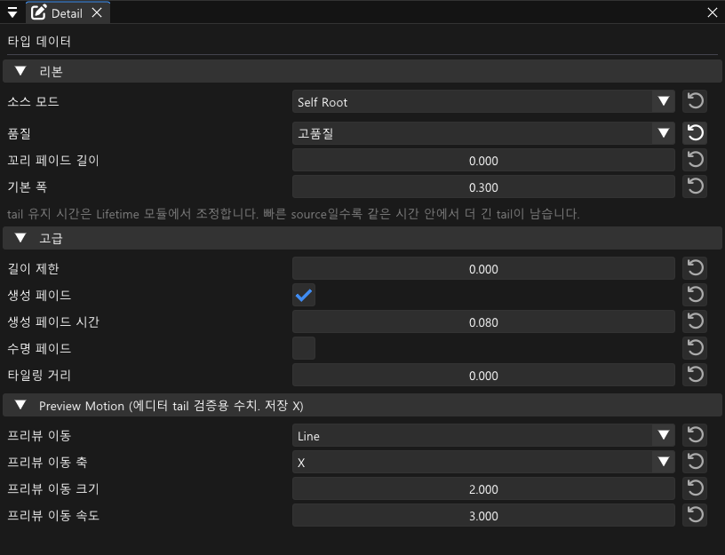

Source History Ribbon은 다음 source mode를 중심으로 이해한다.

- **SelfRoot**: Emitter 자신의 root 움직임 history를 사용한다.
- **ParticleEmitter**: 같은 effect 내부의 다른 Sprite/Mesh particle emitter를 source로 사용한다.

UI나 이전 저장 데이터에는 legacy 의미의 SourceEmitter 표현이 남아 있을 수 있지만, 현재 Save/Open 흐름에서는 SelfRoot 또는 ParticleEmitter로 정리해서 보는 것이 좋다.

ParticleEmitter source를 쓸 때는 source Emitter가 실제 particle 위치 history를 제공할 수 있어야 한다. source가 없거나 disabled 상태라면 ribbon이 기대한 위치를 따라가지 않을 수 있다.

Source History Ribbon의 history는 source가 계속 제공되는 동안 이어지는 흐름으로 이해한다. `Required.duration`은 material/SubUV 같은 반복 phase의 기준이 될 수 있지만, source가 살아 있는 ribbon history를 주기적으로 끊는 기준으로 보지 않는다. source가 끊기면 새 sample 공급만 멈추고, 남아 있는 history는 sample lifetime과 tail 정책에 따라 자연스럽게 사라진다.

`고급`의 `곡선 품질`은 source history path를 얼마나 촘촘하고 부드럽게 render sample로 재구성할지 정한다. `고품질`은 꺾인 source path를 더 부드럽게 만들지만 follower 수가 많으면 preview 비용이 늘 수 있다.

Detail View의 `Preview Motion (에디터 tail 검증용 수치. 저장 X)` 섹션은 Source History Ribbon의 tail 움직임을 EffectEditor 안에서 확인하기 위한 preview 검증 입력이다. effect asset에 저장되는 authoring 값이 아니라 preview lowering에서만 소비되는 editor-only 값으로 본다.

Preview Motion에서 자주 확인하는 값은 다음과 같다.

- `프리뷰 모션`: 움직임 없음(Off), 직선 이동(Line), 호 이동(Arc), 반복 순환(Loop) 중 하나를 고른다.
- `프리뷰 이동 축`: X/Y/Z 중 움직임 기준 축을 고른다.
- `프리뷰 이동 크기`: Line/Arc의 one-shot 이동 반경 또는 Loop 순환 반경이다.
- `프리뷰 이동 속도`: Line/Arc의 one-shot 진행 속도 또는 Loop 반복 속도다.

### 5.6 스프라이트 트레일 데이터(Source History Sprite Trail)

`스프라이트 트레일 데이터`는 source history를 따라 짧은 sprite/card stamp를 찍는 TypeData다.

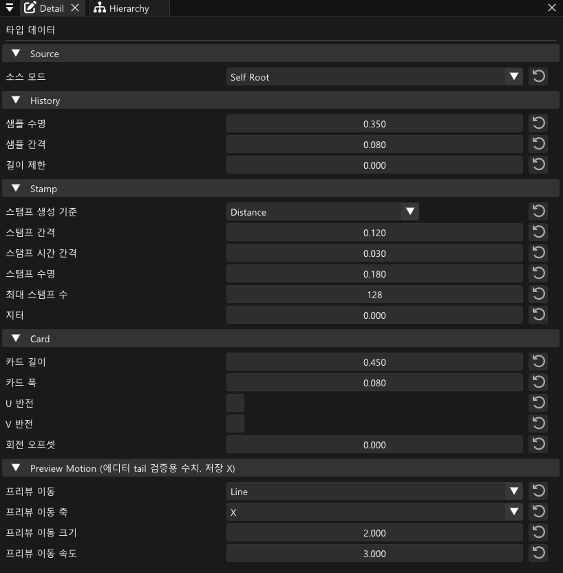

Source History Ribbon처럼 source가 지나간 path를 사용하지만, 최종 렌더 단위는 하나로 이어진 strip이 아니라 서로 독립된 sprite card다. 그래서 번개 조각, 칼날 잔상, 짧은 흡수형 trail처럼 texture 방향과 stamp 수명 체감이 중요한 효과에 맞다.

Detail View에서는 다음 그룹으로 나누어 읽는다.

| 그룹 | 주요 UI | 의미 | 주의점 |
| --- | --- | --- | --- |
| `Source` | `Source Mode`, `Source Emitter`, `최대 추적 수` | 어떤 source 위치 history를 따라갈지 정한다. | ParticleEmitter source는 같은 effect 안에서 위치를 제공할 수 있어야 한다. |
| `History` | `샘플 수명`, `길이 제한` | source가 지나간 path sample을 얼마나 오래 보관하고 어디까지 stamp 후보로 볼지 정한다. | stamp의 표시 수명은 `Lifetime` Module이 소유한다. |
| `곡선 품질` | `곡선 품질`, `샘플 간격`, `곡선 분할`, `탄젠트 스무딩` | source history path를 stamp 위치와 path tangent로 샘플링할 때의 곡선 품질을 정한다. | `고품질`은 각진 path를 줄이지만 stamp 수가 많으면 preview 비용이 늘 수 있다. |
| `Stamp` | `스탬프 생성 기준`, `스탬프 간격`, `스탬프 시간 간격`, `최대 스탬프 수`, `지터` | path 위에 sprite card를 언제, 얼마나 만들지 정한다. | `Distance`는 이동 거리 기준, `Time`은 시간 간격 기준으로 stamp를 찍는다. |
| `Card` | `카드 길이`, `카드 폭`, `U 반전`, `V 반전`, `회전 오프셋` | 각 stamp card의 기준 크기와 texture 방향 보정을 정한다. | 실제 최종 크기는 `초기 크기`, `수명에 따른 크기` 같은 Module과 함께 곱해질 수 있다. |
| `Preview Motion` | `프리뷰 모션`, `프리뷰 이동 축`, `프리뷰 이동 크기`, `프리뷰 이동 속도` | EffectEditor 안에서 source history 움직임을 검증하기 위한 입력이다. | 저장되는 effect 연출 정책이 아니라 preview 검증용 값으로 본다. |

Sprite Trail의 TypeData는 source/history/stamp/card의 기본 생성 계약을 소유한다. 생성된 stamp가 path 위에서 어떻게 따라가거나 흡수될지는 `Path Follow`, `Path Replay` 같은 전용 Module에서 다룬다.

### 5.7 빔 데이터

`빔 데이터`는 authored local path 기반의 generated strip을 만들 때 사용한다.

Beam에서 가장 먼저 볼 값은 `끝점 방식`이다.

- **StartEnd**: local start/end 위치를 직접 지정한다.
- **DirectionLength**: 방향과 길이로 beam path를 만든다.

Branch 관련 값은 beam의 가지 path를 어떻게 생성할지 결정한다. 현재 branch preset은 다음 계열로 이해하면 된다.

- **EndGuided**: beam 끝점 방향으로 수렴하는 branch.
- **DownStrike**: 아래 방향으로 떨어지는 번개형 branch.
- **Entangle**: parent path 주변을 감는 branch.
- **ShortCrack**: 시작 부근에 짧게 갈라지는 crack형 branch.

Beam TypeData의 endpoint, branch, strip 값은 시각적 generated path authoring data다. gameplay hit 판정, target binding, chain target 선택 같은 gameplay logic의 정본으로 해석하지 않는다.

### 5.8 Type 비교 표

| Type | UI 표시 | 핵심 개념 | 주요 입력 | 주로 쓰는 Module | 주의점 |
| --- | --- | --- | --- | --- | --- |
| Sprite | `타입 데이터 (미장착)` | Particle emission | Spawn/Lifetime/Initial/Over-Life | `스폰`, `수명`, `초기 컬러`, `수명에 따른 크기` | 가장 기본적인 particle-style Emitter |
| Mesh | `메시 데이터` | Mesh 기반 effect | model, material, mesh transform | mesh 전용 initial/over-life Module | Mesh Data Preview에서 model/material 확인 |
| Trail | `트레일 데이터` | 움직임 sample 기반 trail | base/tip sample, length, width | `거리당 스폰`, color/size 계열 | Preview helper는 editor-only |
| Ribbon | `리본 데이터` | source history 기반 strip | source mode, source emitter, lane | color/size/material/SubUV 계열 | source reference 확인 필요 |
| Sprite Trail | `스프라이트 트레일 데이터` | source history 기반 sprite/card stamp | source, history, stamp, card | color/size/rotation/velocity/SubUV/material, `Path Follow`, `Path Replay` | `스폰`, `거리당 스폰`과 생성 책임 혼동 금지 |
| Beam | `빔 데이터` | generated beam path | endpoint, length, branch preset | color/size/SubUV/material 계열 | gameplay hit logic과 구분 |

## 6. Modules

Module은 Emitter의 동작을 구성하는 기능 단위다. EffectEditor의 Module 이름은 UI에 보이는 한국어 표시를 기준으로 읽는다.

### 6.1 Detail 값 읽는 법

Detail View의 값은 대부분 같은 규칙으로 편집된다.

Module 자체의 사용/미사용은 Emitter 창의 Module row 체크박스로 조절한다. Detail View 안의 checkbox는 `루프`, `X축 적용`, `변조 사용`처럼 해당 Module 안의 하위 기능을 켜고 끄는 용도로 읽는다.

| UI 요소 | 의미 | 읽는 법 |
| --- | --- | --- |
| field label | 편집 대상 이름 | label 옆 tooltip이 있으면 현재 코드의 가장 가까운 설명으로 본다. |
| reset 버튼 | 기본값 복원 | 해당 field 또는 row를 default 값으로 돌린다. Module을 삭제하는 기능이 아니다. |
| checkbox | 기능 on/off | `루프`, `X축 적용`, `변조 사용`처럼 특정 sub-feature를 켜고 끈다. |
| combo | 모드 선택 | `화면 정렬`, `재생 방식`, `시간 축`처럼 해석 방식을 바꾼다. |
| 숫자 입력 | 단일 scalar | 거리, 시간, 각도, 배율, index 같은 값이다. label의 단위를 같이 본다. |
| Vec2 / Vec3 | 2축 또는 3축 값 | 위치/속도/크기/회전처럼 축별 값을 갖는다. |
| Color | 색상 값 | RGB와 alpha가 분리되어 있는 Module도 있으므로 alpha를 따로 확인한다. |
| disabled text | 구현/해석 메모 | 현재 UI 기준에서 중요한 제약이다. 문서에서도 확정 설명보다 이 메모를 우선한다. |

값의 성격은 세 가지로 구분한다.

- **authoring data**: 저장되는 Emitter/TypeData/Module payload다.
- **editor-only helper**: preview 관측을 돕는 에디터 세션 상태다. Trail preview object, Preview Plane이 여기에 속한다.
- **preview/runtime 경계 값**: preview lowering과 Client runtime loading에서 각각 소비될 수 있는 값이다. runtime 소비가 코드에서 명확하지 않은 경우 문서에서는 `runtime 소비 확인 필요`로 남긴다.

### 6.2 분포 UI

여러 Module field는 `분포 타입`을 가진다. 분포는 "이 값이 하나의 고정값인지, 랜덤 범위인지, 시간에 따른 curve인지"를 정하는 공통 UI다.

| 분포 타입 | 의미 | 표시되는 값 | 현재 사용 기준 |
| --- | --- | --- | --- |
| `float 고정값` | 하나의 scalar 값을 항상 사용한다. | `상수` | 가장 단순한 숫자 값이다. |
| `float 랜덤값` | 최소/최대 사이에서 값을 샘플한다. | `최소`, `최대`, `랜덤 시드` | spawn 시점 또는 해당 field가 샘플되는 시점에 랜덤값을 뽑는다. |
| `float 고정값 커브` | 시간/progress에 따라 scalar 값을 curve로 평가한다. | `포인트`, `In 값`, `Out 값`, `보간 모드` | Curve Editor와 연결된다. |
| `Vec2 고정값` | X/Y 값 하나를 사용한다. | `상수` | size, scale 같은 2축 값에 사용한다. |
| `Vec2 랜덤값` | X/Y 최소/최대 범위에서 샘플한다. | `최소`, `최대`, `랜덤 시드` | 축별 범위가 따로 있다. |
| `Vec2 고정값 커브` | X/Y 값을 curve key로 평가한다. | key별 Vec2 `Out 값` | Curve Editor에서는 X/Y channel로 나뉘어 보인다. |
| `Vec3 고정값` | X/Y/Z 값 하나를 사용한다. | `상수` | 위치, 속도, 메시 크기/회전에 사용한다. |
| `Vec3 랜덤값` | X/Y/Z 최소/최대 범위에서 샘플한다. | `최소`, `최대`, `랜덤 시드` | 축별 범위가 따로 있다. |
| `Vec3 고정값 커브` | X/Y/Z 값을 curve key로 평가한다. | key별 Vec3 `Out 값` | 일부 field에서는 UI에 있어도 미구현으로 표시될 수 있다. |
| `Color 고정값` | 색상 하나를 사용한다. | `상수` 또는 `상수 RGB` | RGB/alpha 분리 여부를 같이 확인한다. |
| `Color 랜덤값` | 색상 범위에서 샘플한다. | `최소`, `최대` 또는 `최소 RGB`, `최대 RGB` | RGB 값의 랜덤 범위다. |
| `Color 고정값 커브` | 시간/progress에 따라 색상을 curve로 평가한다. | key별 Color `Out 값` | Curve Editor에서는 R/G/B channel 중심으로 보인다. |
| `랜덤 커브 (미구현)` | 랜덤 범위와 curve를 결합하는 후보 | 비활성 | 현재 실사용 대상으로 보지 않는다. |
| `파티클 파라미터 (미구현)` | 외부 parameter 기반 값 후보 | 비활성 | 현재 실사용 대상으로 보지 않는다. |

`랜덤 시드`는 Uniform 분포 샘플의 재현성을 다룬다.

| UI 이름 | 의미 | 주의점 |
| --- | --- | --- |
| `시드 모드` | 같은 시드가 같은 랜덤 분포를 재현하게 할지 정한다. | 랜덤 결과를 고정하고 싶을 때 중요하다. |
| `시드` | Uniform 샘플에 사용하는 seed 값이다. | `무작위` 버튼으로 새 seed를 뽑을 수 있다. |
| `재생마다 변주` | 재생마다 생성되는 seed를 이 랜덤 샘플에 섞는다. | 켜면 같은 effect라도 재생마다 약간 달라질 수 있다. |

분포 모드를 바꾸면 기존 값은 가능한 범위에서 다음 모드의 초기값으로 옮겨진다. 예를 들어 고정값에서 랜덤값으로 바꾸면 최소/최대가 같은 값으로 시작하고, 랜덤값에서 고정값 커브로 바꾸면 기존 범위의 시작/끝 값을 curve의 초기 key로 옮기는 식이다. 이 변환은 편집 편의를 위한 것이며, 최종 결과는 바꾼 뒤 표시되는 값을 기준으로 다시 확인해야 한다.

고정값 커브의 key UI는 다음처럼 읽는다.

| UI 이름 | 의미 |
| --- | --- |
| `포인트` | 현재 key 수와 최대 key 수를 보여준다. `+` 버튼으로 key를 추가한다. |
| `전체 보간` | 모든 key의 보간 모드를 한 번에 바꾼다. |
| `인덱스 [n]` | n번째 key다. 화살표 버튼은 key 순서를 바꾸고, 휴지통 버튼은 key를 삭제한다. |
| `In 값` | curve 입력 시간/progress다. 현재 UI는 0~1 범위로 정규화한다. |
| `Out 값` | 해당 입력에서 출력할 값이다. Float/Vec2/Vec3/Color 타입에 따라 모양이 다르다. |
| `보간 모드` | 이 key 이후 구간을 어떤 방식으로 보간할지 정한다. |
| `도착 탄젠트` / `출발 탄젠트` | `Curve Auto Clamped`에서 자동 계산되거나 표시되는 tangent 값이다. |

지원되는 보간은 `Linear`, `Constant`, `Curve Auto Clamped`다. `Curve Auto`, `Curve User`, `Curve Break`는 UI에 보일 수 있지만 `(미구현)`으로 표시되므로 현재 편집 기준에서는 사용하지 않는다.

### 6.3 Module Picker 상태

Module picker는 현재 선택한 Emitter에 대해 Module을 추가할 수 있는지 상태로 보여준다.

| 상태 | 의미 |
| --- | --- |
| `추가 가능` | 현재 Emitter에 추가할 수 있다. |
| `이미 장착됨` | 같은 타입의 Module이 이미 있다. |
| `현재 TypeData와 비호환` | 현재 TypeData에서는 preview/runtime 입력으로 소비되지 않는다. Mesh 전용 Module처럼 사유가 명확한 경우 `Mesh TypeData 전용` 같은 구체 문구로 표시될 수 있다. |
| `미구현` | 후보는 있지만 현재 버전에서 추가 대상으로 열지 않은 항목이다. |

### 6.4 Module 계열

Module은 다음 계열로 나눠 보면 이해하기 쉽다.

- **필수 / 생성 계열**: `필수`, `스폰`, `수명`.
- **초기값 계열**: `초기 위치`, `초기 크기`, `초기 속도`, `초기 컬러`, `초기 회전`.
- **수명 변화 계열**: `수명에 따른 색상`, `수명에 따른 크기`, `수명에 따른 속도`, `수명에 따른 회전`.
- **공간/방사 계열**: `구 위치`, `평면/방사 위치`, `속도 원뿔`, `평면/방사 회전`, `구/방사 회전`.
- **Mesh 전용 계열**: `초기 메시 크기`, `수명에 따른 메시 회전` 등.
- **Material/SubUV 계열**: `머티리얼 변조`, `서브UV 프레임 선택/재생`.
- **Trail 계열**: `거리당 스폰`.
- **스프라이트 트레일 경로 계열**: `Path Follow`, `Path Replay`.

### 6.5 필수(Required)

`필수` Module은 Emitter 렌더링과 재생에 필요한 기본 resource, material, transform, timing, sorting 값을 담는다.

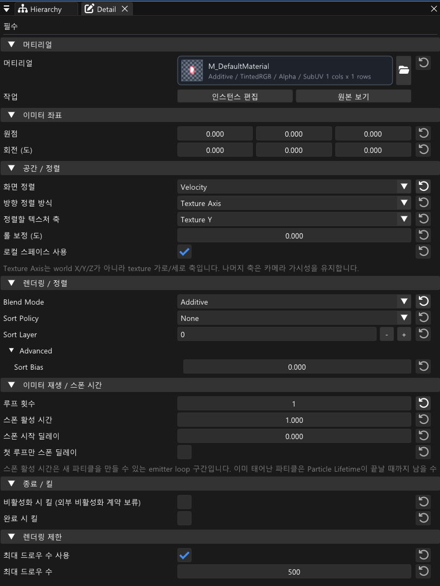

주로 쓰는 TypeData: 모든 Emitter. Mesh TypeData에서는 Required의 material 편집 버튼이 비활성화될 수 있고, MeshData의 Assigned Material 쪽에서 편집한다.

Detail View에서는 `머티리얼`, `이미터 좌표`, `공간 / 정렬`, `렌더링 / 정렬`, `이미터 재생 / 스폰 시간`, `종료 / 킬`, `렌더링 제한` 그룹으로 나뉜다.

| UI 이름 | 의미 | 값 해석 | 분포/시간축 | 주의점 |
| --- | --- | --- | --- | --- |
| `머티리얼` | Emitter-local material slot이다. | texture/material preview와 drop slot을 통해 지정한다. | 고정 authoring 값 | Mesh는 MeshData Assigned Material에서 편집한다. |
| `인스턴스 편집` | embedded material instance 편집 창을 연다. | Required가 들고 있는 material copy를 편집한다. | editor action | source material asset 전역 수정으로 보지 않는다. |
| `원본 보기` | 원본 material/preset 확인 창을 연다. | 선택 원본을 확인한다. | editor action | Mesh에서는 비활성화될 수 있다. |
| `원점` | Emitter origin offset이다. | Emitter local 기준 위치 보정으로 읽는다. | Vec3 고정값 | preview 위치 기준에 영향이 있다. |
| `회전 (도)` | Emitter local 회전이다. | degree 단위 회전 보정이다. | Vec3 고정값 | 축별 회전으로 입력한다. |
| `화면 정렬` | sprite/card가 camera나 world에 정렬되는 방식이다. | `Facing Camera Position`, `Rectangle`, `World Up Facing Camera`, `Square`, `Away from Center`, `Velocity`, `World Plane XY`, `World Plane XZ` 중 고른다. | combo | 하위 옵션 노출 여부를 결정한다. |
| `방향 정렬 방식` | radial/velocity 계열에서 방향을 card에 어떻게 반영할지 정한다. | look 방향 또는 texture axis 기준을 고른다. | combo | UI tooltip과 disabled text를 우선한다. |
| `정렬할 텍스처 축` | texture X/Y 중 어느 축을 방향에 맞출지 정한다. | 긴 texture의 방향성을 맞출 때 쓴다. | combo | world axis가 아니라 texture 가로/세로 축이다. |
| `롤 보정 (도)` | 정렬 후 roll 보정값이다. | degree 단위 추가 회전이다. | float 고정값 | texture axis 정렬에서 주로 의미가 있다. |
| `로컬 스페이스 사용` | Emitter local space 기준 사용 여부다. | 켜면 local transform 기준 해석이 강해진다. | bool | runtime 소비 경계는 TypeData와 renderer별로 확인한다. |
| `Blend Mode` | material blend path다. | AlphaBlend/Additive/Masked 계열 선택이다. | combo | Trail은 v1에서 Masked 선택을 막고 AlphaBlend/Additive 경로를 유지한다. |
| `Sort Policy` | 투명 정렬 기준이다. | 카메라/거리/정책별 정렬을 선택한다. | combo | 같은 layer 안에서 결과가 달라진다. |
| `Sort Mode` | 투명 정렬의 세부 mode다. | `None`, `View Proj Depth`, `Distance to View`, `Age Oldest First`, `Age Newest First` 중 고른다. | combo | `Sort Policy`와 별개 field이므로 둘을 함께 확인한다. |
| `Sort Layer` | 정렬 layer다. | 큰 단위의 draw order를 나눈다. | int 고정값 | 같은 policy 안에서 우선순위 역할을 한다. |
| `Sort Bias` | 같은 layer/policy 안의 마지막 보정값이다. | 작은 draw order 보정이다. | float 고정값 | 큰 구조 정렬은 Sort Layer/Policy로 먼저 잡는다. |
| `루프 횟수` | Emitter loop 반복 수다. | 0 또는 특정 값의 의미는 runtime 정책을 확인한다. | uint 고정값 | loop 기반 sampling Module과 함께 본다. |
| `스폰 활성 시간` | 새 particle을 만들 수 있는 loop 구간이다. | 이 시간이 지나도 이미 태어난 particle은 수명까지 남을 수 있다. | float 고정값 | `수명`과 혼동하지 않는다. |
| `스폰 시작 딜레이` | spawn 시작 전 delay다. | loop 시작 후 일정 시간 spawn을 미룬다. | float 고정값 | `첫 루프만 스폰 딜레이`와 함께 본다. |
| `첫 루프만 스폰 딜레이` | 첫 loop에만 delay 적용 여부다. | 반복 loop마다 delay를 줄지 결정한다. | bool | 반복 effect에서 체감 차이가 크다. |
| `비활성화 시 킬 (외부 비활성화 계약 보류)` | 외부 비활성화 시 active particle 종료 후보 값이다. | 현재 문구 그대로 계약 보류 상태로 본다. | bool | runtime 정책 확정값처럼 설명하지 않는다. |
| `완료 시 킬` | 완료 시 active particle도 즉시 종료한다. | 켜면 남은 particle life를 기다리지 않을 수 있다. | bool | disabled text가 표시된다. |
| `최대 드로우 수 사용` | draw count 제한 사용 여부다. | 켜면 아래 최대 수가 적용된다. | bool | 과도한 draw를 제한할 때 사용한다. |
| `최대 드로우 수` | 그릴 최대 요소 수다. | runtime draw 제한 수로 읽는다. | uint 고정값 | 너무 낮으면 일부 요소가 보이지 않는다. |

Sprite Trail에서는 방향 정렬 옵션에 따라 `정렬할 텍스처 축` 대신 `카드 길이 축`이 표시될 수 있다. 이 값은 texture X/Y 중 어느 축을 stamp card의 긴 방향으로 맞출지 정하는 보정값이며, source path 자체를 바꾸는 값은 아니다.

Sprite Trail의 `화면 정렬`은 일반 Sprite와 저장 enum은 같지만, stamp center/tangent를 이미 source history에서 받은 뒤 card basis만 고르는 의미로 해석한다.

| Sprite Trail 화면 정렬 | 해석 |
| --- | --- |
| `Facing Camera Position` | stamp 위치는 path 위에 유지하고, 각 card가 자기 위치에서 카메라 위치를 바라본다. Path tangent는 회전 기준으로 쓰지 않는다. |
| `Rectangle` | legacy alias다. card 세로축을 World Up으로 유지하고, 가로축은 카메라 가시성을 유지하는 방향으로 잡는다. `카드 길이 축`은 texture X/Y 중 어느 축을 길이로 볼지만 정한다. |
| `World Up Facing Camera` | `Rectangle`과 같은 World Up upright card basis를 명시적으로 선택한다. 새 작업에서는 이 이름을 우선 사용한다. |
| `Square` | 카메라 화면 평면 기준 card에서 더 큰 축으로 정사각형을 만든다. |
| `Velocity` | SourceHistorySpriteTrail에서는 실제 velocity가 아니라 path tangent를 기준 방향으로 사용한다. `방향 정렬 방식`과 `카드 길이 축`으로 tangent를 look 또는 texture 축에 맞춘다. |

### 6.6 스폰

`스폰`은 Emitter가 particle 또는 visual 요소를 얼마나 생성하는지 결정한다.

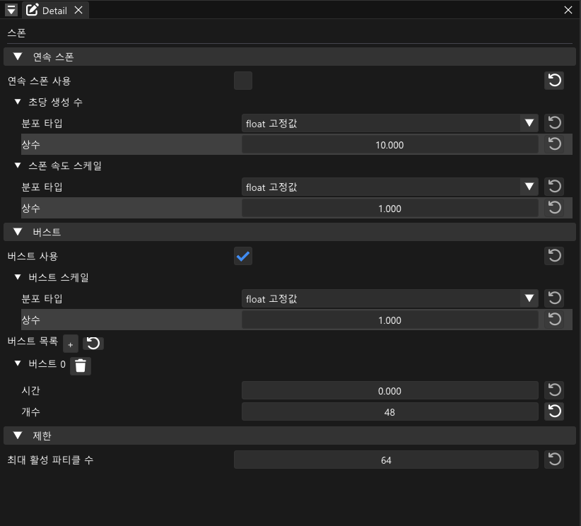

주로 쓰는 TypeData: Sprite/ Mesh 계열의 particle-style spawn. Trail/Ribbon/Beam에서는 TypeData별 lowering에서 직접 소비하는 값과 아닌 값을 구분해야 한다. Sprite Trail의 stamp 생성 밀도는 `스폰` Module이 아니라 TypeData의 `스탬프 간격` / `스탬프 시간 간격`이 소유한다.

`초당 생성 수`, `스폰 속도 스케일`, `버스트 스케일`의 분포 의미는 모드별로 다르다. `Constant`는 고정값, `Uniform`은 loop 또는 burst 실행 단위 랜덤 샘플, `ConstantCurve`는 Emitter loop 진행률 0..1 기준 시간 커브다.

| UI 이름 | 의미 | 값 해석 | 분포/시간축 | 주의점 |
| --- | --- | --- | --- | --- |
| `연속 스폰 사용` | spawn rate 사용 여부다. | 켜면 시간 기반 연속 생성이 활성화된다. | bool | 꺼져 있으면 burst만으로 보일 수 있다. |
| `초당 생성 수` | 초당 생성할 수량이다. | 값이 높을수록 생성 밀도가 커진다. | float 분포 / loop 진행률 | ConstantCurve는 loop 안에서 생성 밀도를 시간에 따라 바꾼다. |
| `스폰 속도 스케일` | spawn rate multiplier다. | `초당 생성 수`에 곱해지는 배율로 본다. | float 분포 / loop 진행률 | 0에 가까우면 생성이 크게 줄어든다. |
| `버스트 사용` | burst list 사용 여부다. | 켜면 지정 시간에 burst 생성이 가능하다. | bool | 연속 스폰과 독립적으로 볼 수 있다. |
| `버스트 스케일` | burst count multiplier다. | burst 목록의 개수에 곱해지는 배율이다. | float 분포 / burst 시간 진행률 | ConstantCurve는 각 burst 시간의 loop phase로 평가된다. |
| `버스트 목록` | burst entry 목록이다. | 각 entry는 시간과 개수를 가진다. | list | 현재 UI는 live 기능으로 본다. |
| `시간` | burst가 발생할 시간이다. | Emitter loop 내 시간으로 읽는다. | float 고정값 | `스폰 활성 시간`과 함께 확인한다. |
| `개수` | 해당 burst에서 생성할 수량이다. | burst particle count다. | uint 고정값 | `버스트 스케일`이 함께 곱해질 수 있다. |
| `최대 활성 파티클 수` | 동시에 살아 있을 수 있는 최대 수다. | active particle cap이다. | uint 고정값 | 낮으면 spawn이 충분해도 화면 수가 제한된다. |

### 6.7 수명

`수명`은 생성된 particle 또는 visual life가 얼마나 유지되는지 정한다.

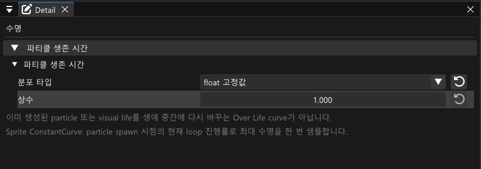

주로 쓰는 TypeData: Sprite, Mesh, Trail, Ribbon, Beam. 단, curve sampling axis는 타입별로 다르거나 일부 범위 밖일 수 있다.

| UI 이름 | 의미 | 값 해석 | 분포/시간축 | 주의점 |
| --- | --- | --- | --- | --- |
| `파티클 생존 시간` | 생성된 particle/visual의 최대 생존 시간이다. | 값이 길수록 오래 남는다. | float 분포 | Over-Life curve가 아니라 spawn 시점 또는 loop 진행 기준으로 한 번 샘플되는 값이다. |

타입별 메모는 UI disabled text를 따른다.

- Sprite: ConstantCurve는 particle spawn 시점의 현재 loop 진행률로 최대 수명을 한 번 샘플한다.
- Mesh: ConstantCurve는 particle spawn 시점의 현재 loop 진행률로 최대 수명을 한 번 샘플한다.
- Beam: ConstantCurve는 전체 반복 순서 진행률로 각 loop의 visual life를 한 번 샘플한다. 무한 반복에서는 반복 번호를 curve 구간에 순환 적용한다.
- Sprite Trail: ConstantCurve는 stamp 생성 시점의 현재 loop 진행률로 stamp lifetime을 한 번 샘플한다.
- Trail/Ribbon: Constant/Uniform 수명은 지원하지만, ConstantCurve는 segment/sample별 lifetime 저장 구조가 없어 현재 비지원으로 표시된다.

### 6.8 위치 Module

위치 Module은 생성 시점의 위치 또는 source sample 위치를 만든다.

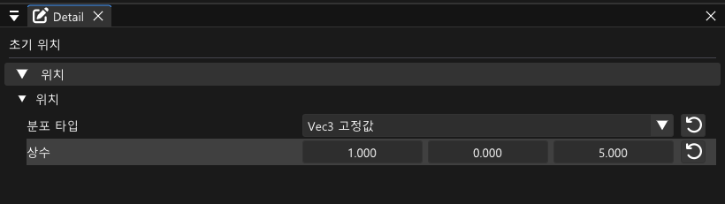

`초기 위치`는 Emitter origin 기준 위치 offset 분포다.

| UI 이름 | 의미 | 값 해석 | 분포/시간축 | 주의점 |
| --- | --- | --- | --- | --- |
| `위치` | 생성 시점 위치 offset이다. | X/Y/Z 축별 위치 보정이다. | Vec3 분포 | spawn 시점 1회 샘플로 이해한다. |

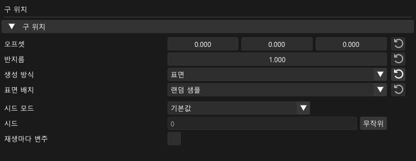

`구 위치`는 구 표면 또는 부피에서 위치를 샘플한다.

| UI 이름 | 의미 | 값 해석 | 분포/시간축 | 주의점 |
| --- | --- | --- | --- | --- |
| `오프셋` | 구 중심 offset이다. | Emitter origin에서 구 중심을 이동한다. | Vec3 고정값 | 모든 구 위치 sample의 기준이다. |
| `반지름` | 구 반지름이다. | 음수는 0 이상으로 정규화된다. | float 고정값 | 너무 작으면 중심 근처에서만 생성된다. |
| `생성 방식` | 구 내부/표면 sample 선택이다. | `부피(Volume)` 또는 `표면(Surface)`을 고른다. | combo | `표면 배치`는 `표면(Surface)`일 때 의미가 있다. |
| `표면 배치` | 표면 sample 배치 방식이다. | `랜덤 샘플(Random)` 또는 `인덱스 균등(EvenByParticleIndex)`을 고른다. | combo | `표면(Surface)`가 아니면 비활성화된다. |
| `랜덤 시드` | 구 위치 랜덤 샘플 seed다. | 같은 seed로 재현 가능하다. | seed UI | Uniform 분포 seed 설명과 같다. |

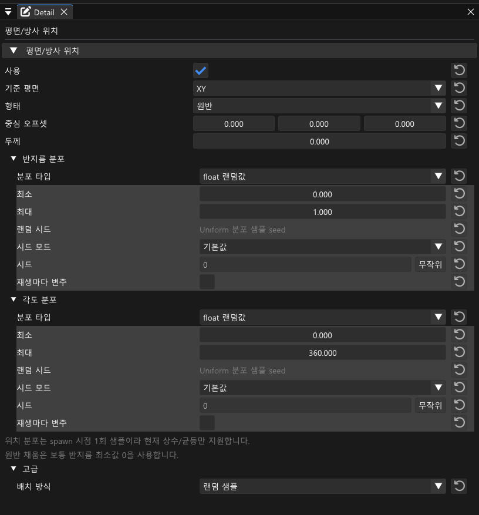

`평면/방사 위치`는 평면 기반 사각/원반/링/호 형태의 위치를 만든다. `기준 평면`은 spawn 위치 분포가 놓이는 평면이며, Required의 `화면 정렬`처럼 sprite/card가 카메라를 바라보는 렌더 정렬 옵션과는 별개다.

| UI 이름 | 의미 | 값 해석 | 분포/시간축 | 주의점 |
| --- | --- | --- | --- | --- |
| `기준 평면` | XY/XZ/YZ 또는 `카메라 정면` 중 기준 평면을 고른다. | U/V 또는 radius/angle이 놓일 plane이다. `카메라 정면`은 현재 preview/runtime camera의 right/up 평면을 spawn 시점에 사용한다. | combo | 이미 생성된 particle을 매 frame 재투영하지 않는다. 방향/회전 Module과 함께 해석된다. |
| `형태` | 위치 샘플링 모양이다. | `사각(Rectangle)`, `원반(Disc)`, `링(Ring)`, `호(Arc)` 중 고른다. | combo | `사각(Rectangle)`과 radial shape의 입력 field가 다르다. |
| `중심 오프셋` | 평면 중심 offset이다. | Emitter origin에서 평면 중심을 이동한다. | Vec3 고정값 | 모든 sample의 기준점이다. |
| `두께` | 기준 평면 normal 방향 위치 범위다. | 두께가 있으면 plane 밖으로 퍼질 수 있다. | float 고정값 | UI tooltip은 음수 정규화 예정이라고 안내한다. |
| `U 분포` | Rectangle의 U축 위치 분포다. | 기준 평면의 첫 축 범위다. | float 분포 | 현재 위치 분포는 spawn 시점 1회 샘플이며 상수/균등 중심이다. |
| `V 분포` | Rectangle의 V축 위치 분포다. | 기준 평면의 두 번째 축 범위다. | float 분포 | Rectangle일 때 사용한다. |
| `반지름 분포` | Disc/Ring/Arc의 radius 분포다. | 중심에서 떨어진 거리다. | float 분포 | 원반 채움은 보통 최소값 0을 사용한다. |
| `각도 분포` | Disc/Ring/Arc의 angle 분포다. | degree 단위 angular 범위다. | float 분포 | Arc 형태에서 특히 중요하다. |
| `배치 방식` | radial shape의 배치 방식이다. | `랜덤 샘플(Random)` 또는 `인덱스 균등(EvenByParticleIndex)`을 고른다. | combo | `사각(Rectangle)`에서는 사용되지 않는다. |

`실린더 위치`는 Sprite와 Mesh Emitter에서 원통 옆면 또는 원통 내부 부피의 위치를 만든다. 터널 벽, 기둥형 범위, 반원통 단면처럼 축 방향 길이가 있는 분포를 잡을 때 사용한다. 위치만 만들며, 흐르는 방향은 속도 계열 Module이 맡고 sprite/card 또는 mesh 회전은 회전 계열 Module이 맡는다.

| UI 이름 | 의미 | 값 해석 | 분포/시간축 | 주의점 |
| --- | --- | --- | --- | --- |
| `길이축` | 원통의 긴 방향이다. | `Local X`, `Local Y`, `Local Look` 중 고른다. | combo | 기본값은 터널형 제작에 맞춘 `Local Look`이다. |
| `생성 방식` | 원통 sample 영역이다. | `옆면(SideSurface)` 또는 `부피(Volume)`를 고른다. | combo | cap surface는 포함하지 않는다. |
| `원주 배치` | angle sample 방식이다. | `랜덤 샘플(Random)` 또는 `인덱스 균등(EvenByParticleIndex)`을 고른다. | combo | 균등 배치는 angle에만 적용되고, 반지름/높이는 분포 seed를 따른다. |
| `중심 오프셋` | 원통 중심 offset이다. | Emitter origin에서 원통 중심을 이동한다. | Vec3 고정값 | 모든 sample의 기준점이다. |
| `반지름 분포` | 중심축에서 떨어진 거리다. | 음수는 0 이상으로 정규화된다. | float 분포 | 옆면에서 min/max가 다르면 두께 있는 shell이 된다. |
| `높이 분포` | 길이축 방향 위치 범위다. | 중심 기준 축 좌표 범위다. | float 분포 | `-5..5`처럼 양방향 길이를 직접 표현할 수 있다. |
| `각도 분포` | 원주 angle 범위다. | degree 단위 angular 범위다. | float 분포 | `0..180`이면 반원통 단면을 만든다. |

### 6.9 크기 Module

크기 Module은 생성 시점 크기와 lifetime 중 크기 배율을 정한다.

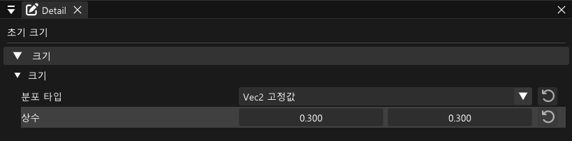

| Module | UI 이름 | 의미 | 값 해석 | 분포/시간축 | 주의점 |
| --- | --- | --- | --- | --- | --- |
| `초기 크기` | `크기` | 생성 시점 Sprite/Ribbon/Beam 계열 크기다. | X/Y 크기 또는 폭/높이 계열 값이다. | Vec2 분포 | Mesh TypeData는 mesh 전용 크기 Module을 우선한다. |

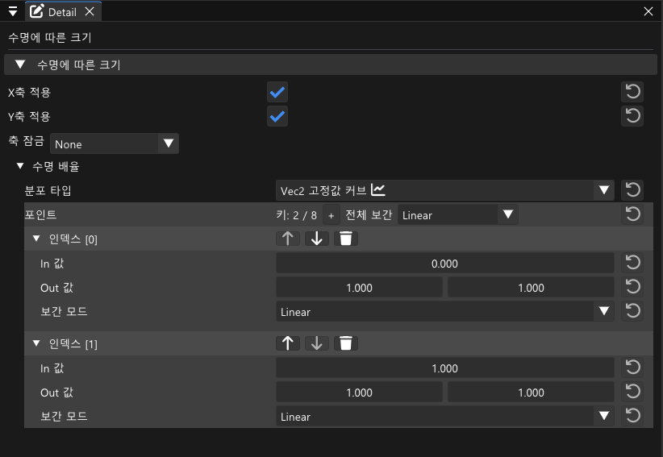

| Module | UI 이름 | 의미 | 값 해석 | 분포/시간축 | 주의점 |
| --- | --- | --- | --- | --- | --- |
| `수명에 따른 크기` | `X축 적용` | X축 scaleOverLife 적용 여부다. | 꺼지면 X축 배율을 적용하지 않는다. | bool | axis lock과 함께 확인한다. |
| `수명에 따른 크기` | `Y축 적용` | Y축 scaleOverLife 적용 여부다. | 꺼지면 Y축 배율을 적용하지 않는다. | bool | axis lock과 함께 확인한다. |
| `수명에 따른 크기` | `축 잠금` | X/Y 중 한 축 값을 다른 축 기준으로 묶을지 정한다. | None/X/Y 중 선택한다. | combo | curve를 한 축 기준으로 정리하고 싶을 때 사용한다. |
| `수명에 따른 크기` | `수명 배율` | lifetime 진행에 따른 size multiplier다. | 1은 원래 크기 유지, 0은 사라지는 방향이다. | Vec2 분포/curve | runtime에서는 scaleOverLife payload로 소비된다. |

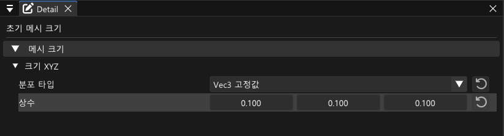

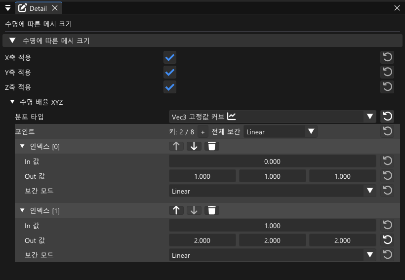

| Module | UI 이름 | 의미 | 값 해석 | 분포/시간축 | 주의점 |
| --- | --- | --- | --- | --- | --- |
| `초기 메시 크기` | `크기 XYZ` | 생성 시점 mesh scale이다. | X/Y/Z 축별 mesh 크기다. | Vec3 분포 | Mesh TypeData 전용이다. |
| `수명에 따른 메시 크기` | `X축 적용` / `Y축 적용` / `Z축 적용` | 축별 lifetime scale 적용 여부다. | 꺼진 축은 배율을 적용하지 않는다. | bool | Mesh 전용이다. |
| `수명에 따른 메시 크기` | `수명 배율 XYZ` | lifetime 진행에 따른 mesh scale multiplier다. | X/Y/Z 축별 배율이다. | Vec3 분포/curve | Mesh TypeData 전용이다. |

### 6.10 속도 / 힘 Module

속도 계열은 생성 시점 velocity, 시간에 따른 acceleration/drag, lifetime에 따른 velocity multiplier를 다룬다.

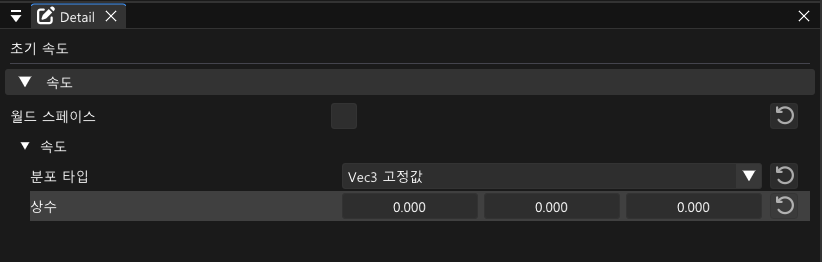

| Module | UI 이름 | 의미 | 값 해석 | 분포/시간축 | 주의점 |
| --- | --- | --- | --- | --- | --- |
| `초기 속도` | `월드 스페이스` | 속도 벡터를 world 기준으로 볼지 정한다. | 켜면 world axis 기준 velocity다. | bool | 꺼졌을 때 local 기준 해석은 Emitter transform과 함께 본다. |
| `초기 속도` | `속도` | 생성 시점 velocity다. | X/Y/Z 방향 속도다. | Vec3 분포 | 지속 force가 아니라 spawn 시점 속도다. |

`초기 방사성 속도`는 생성 위치와 방사 기준점 사이의 방향으로 초기 속도를 더한다.

| UI 이름 | 의미 | 값 해석 | 분포/시간축 | 주의점 |
| --- | --- | --- | --- | --- |
| `방사 기준점` | 방사 방향 계산 기준점이다. | 생성 위치에서 이 기준점으로 방향을 만든다. | Vec3 고정값 | 양수 속도는 기준점에서 멀어지고, 음수는 기준점 쪽으로 이동한다. |
| `월드 스페이스` | 기준점/방향의 space 선택이다. | world 기준 여부를 정한다. | bool | Emitter transform과 함께 본다. |
| `방향 없음 처리` | 위치와 기준점이 같을 때 사용할 fallback 방향이다. | `랜덤 상승(RandomUpward)` 또는 `평면 방사(PlaneRadial)`을 고른다. | combo | 평면/방사 위치가 없으면 `랜덤 상승(RandomUpward)` 방향으로 처리될 수 있다. |
| `속도` | 방사 방향 속도 크기다. | 양수/음수로 발산/흡입 느낌을 만든다. | float 분포 | 지속 attractor가 아니라 생성 시점 속도 항이다. |

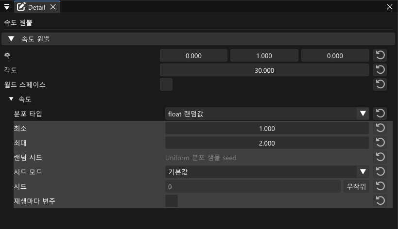

| UI 이름 | 의미 | 값 해석 | 분포/시간축 | 주의점 |
| --- | --- | --- | --- | --- |
| `축` | cone 중심축이다. | 이 축을 중심으로 방향을 뽑는다. | Vec3 고정값 | 생성 위치와 무관하게 축 기준이다. |
| `각도` | cone half-angle이다. | 값이 클수록 방향이 넓게 퍼진다. | float 고정값 | degree 단위다. |
| `월드 스페이스` | 축을 world 기준으로 볼지 정한다. | 켜면 world axis 기준이다. | bool | local/world 차이를 preview에서 확인한다. |
| `속도` | cone 방향으로 더할 속도 크기다. | InitialVelocity, InitialRadialVelocity와 누적된다. | float 분포 | 여러 velocity Module을 같이 쓰면 합산 결과가 커질 수 있다. |

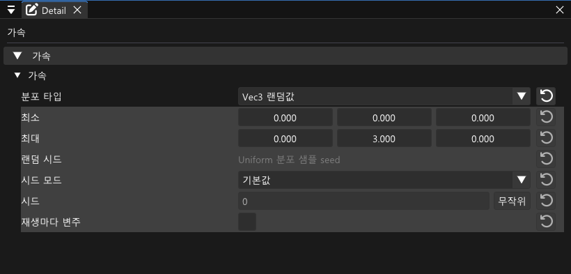

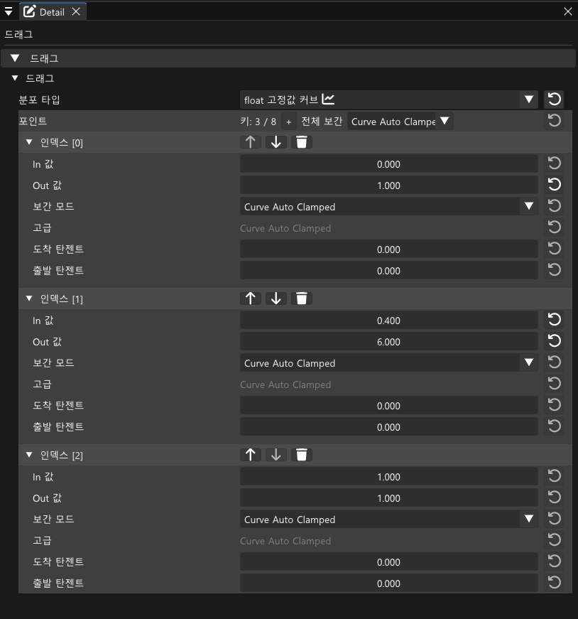

| Module | UI 이름 | 의미 | 값 해석 | 분포/시간축 | 주의점 |
| --- | --- | --- | --- | --- | --- |
| `가속` | `월드 스페이스` | 가속 벡터의 좌표계를 정한다. | 켜면 world axis, 끄면 emitter local axis 기준이다. | bool | 기본값은 켜짐이다. 중력/상승처럼 effect 회전과 무관한 힘은 켜둔다. |
| `가속` | `가속` | 시간에 따라 더해지는 velocity 변화다. | X/Y/Z acceleration이다. | Vec3 분포 | 지속적으로 속도를 바꾼다. |
| `드래그` | `드래그` | 속도 감쇠 계수다. | 값이 커질수록 velocity가 빨리 줄어든다. | float 분포 | 너무 크면 거의 멈춘 것처럼 보일 수 있다. |

`가속`의 `고정값 커브`는 particle 또는 stamp life progress 기준으로 절대 가속을 평가한다. `Constant`, `Linear`, `CurveAutoClamped` 보간과 tangent 모양은 Sprite, Mesh, Sprite Trail runtime에서 같은 의미로 소비된다.

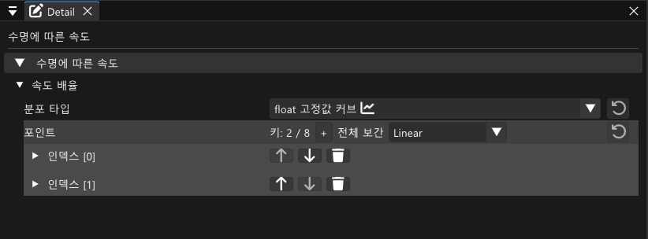

| Module | UI 이름 | 의미 | 값 해석 | 분포/시간축 | 주의점 |
| --- | --- | --- | --- | --- | --- |
| `수명에 따른 속도` | `속도 배율` | lifetime 진행에 따른 velocity multiplier다. | 1은 유지, 0은 속도 제거 방향이다. | float 분포/curve | 기존 velocity에 대한 배율로 본다. |

Sprite Trail에서 `Path Follow` 또는 `Path Replay`가 위치 정본을 소유할 때는 source history path 위 좌표가 stamp 중심 위치를 결정한다. 이 경우 일반 velocity/acceleration/drag 계열은 stamp 중심 이동에 반영되지 않으므로, 경로 흡수 연출은 경로 Module에서 먼저 잡는 편이 안전하다.

### 6.11 회전 / 방향 Module

회전 Module은 생성 시점 회전, lifetime 회전, radial frame 기반 방향 정렬, 회전 속도를 다룬다.

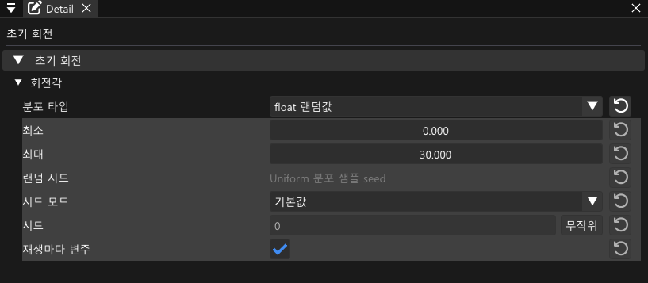

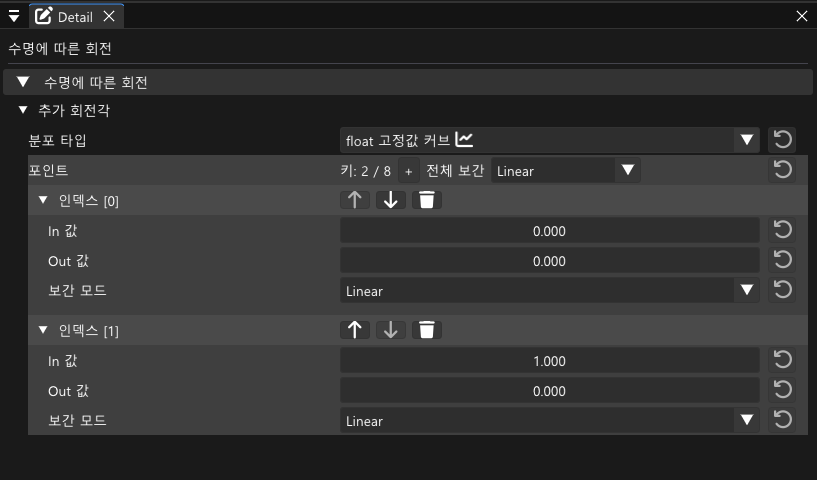

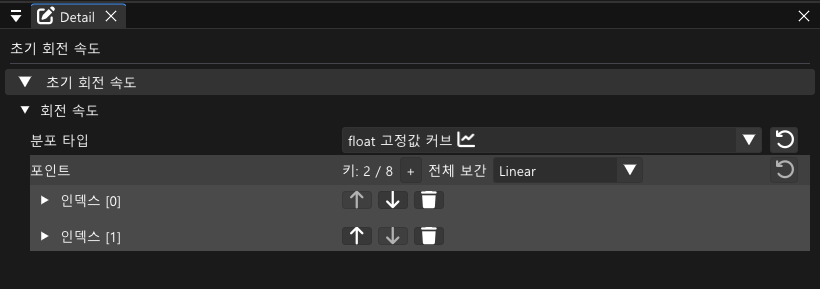

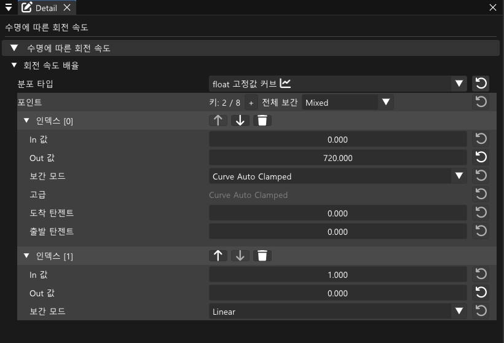

| Module | UI 이름 | 의미 | 값 해석 | 분포/시간축 | 주의점 |
| --- | --- | --- | --- | --- | --- |
| `초기 회전` | `회전각` | 생성 시점 회전각이다. | degree 단위다. | float 분포 | spawn 시점 값이다. |
| `수명에 따른 회전` | `추가 회전각` | lifetime 동안 더할 회전각이다. | degree 단위 누적 회전이다. | float 분포/curve | 초기 회전과 구분한다. |
| `초기 회전 속도` | `회전 속도` | 초당 회전 속도다. | degree/sec 계열로 읽는다. | float 분포 | 회전각이 아니라 속도다. |
| `수명에 따른 회전 속도` | `회전 속도 배율` | 회전 속도 multiplier다. | 1은 유지, 0은 회전 속도 제거 방향이다. | float 분포/curve | 초기 회전 속도와 함께 본다. |

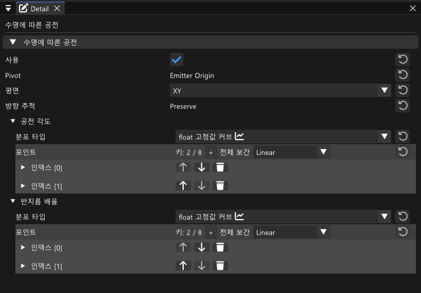

`수명에 따른 공전`은 Emitter origin 기준으로 위치를 회전시키는 Module이다.

| UI 이름 | 의미 | 값 해석 | 분포/시간축 | 주의점 |
| --- | --- | --- | --- | --- |
| `Pivot` | 공전 중심이다. | 현재 UI는 `Emitter Origin` read-only다. | read-only | v1 runtime은 EmitterOrigin만 소비한다고 표시한다. |
| `평면` | 공전 plane이다. | XY/XZ/YZ 중 선택한다. | combo | 회전축 선택으로 이해한다. |
| `방향 추적` | orientation follow 방식이다. | 현재 UI는 `Preserve` read-only다. | read-only | v1 runtime은 orientation follow를 적용하지 않는다고 표시한다. |
| `공전 각도` | lifetime 동안 회전할 각도다. | degree 단위다. | float 분포/curve | 위치가 pivot 기준으로 회전한다. |
| `반지름 배율` | lifetime 동안 orbit radius를 바꾸는 배율이다. | 1은 유지, 0은 pivot으로 수렴하는 방향이다. | float 분포/curve | 단순 sprite 회전과 다르다. |

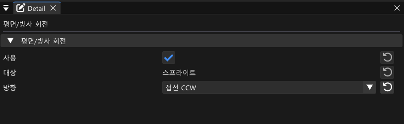

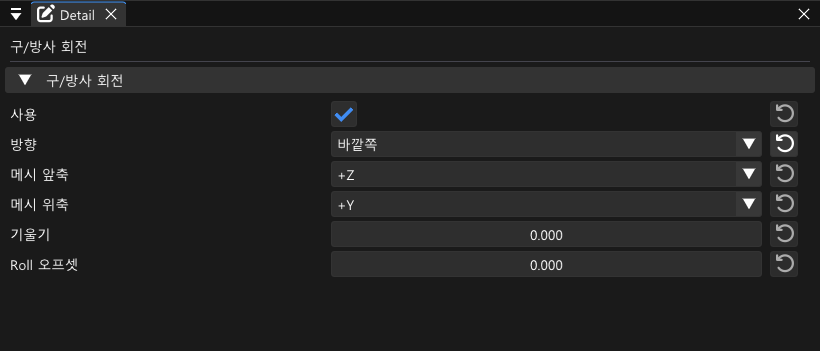

| Module | UI 이름 | 의미 | 값 해석 | 분포/시간축 | 주의점 |
| --- | --- | --- | --- | --- | --- |
| `평면/방사 회전` | `대상` | 현재 Emitter 타입 기준 자동 대상이다. | read-only | targetKind 저장값은 유지하지만 편집 UI는 숨긴다. |
| `평면/방사 회전` | `방향` | radial/tangent/plane normal 방향을 고른다. | FaceRadialOut/In, FaceTangentCW/CCW, FacePlaneNormal 등 | combo | plane radial frame을 만들 수 없으면 의미가 없다. |
| `평면/방사 회전` | `메시 앞축` / `메시 위축` | Mesh3D 대상에서 mesh 축을 어떤 방향에 맞출지 정한다. | Positive/Negative X/Y/Z | combo | Mesh TypeData에서 주로 중요하다. |
| `평면/방사 회전` | `기울기` | radial frame 기준 tilt 보정이다. | degree | float 고정값 | 미세한 방향 보정에 사용한다. |
| `평면/방사 회전` | `Roll 오프셋` | radial frame 기준 roll 보정이다. | degree | float 고정값 | texture/model 방향 보정에 사용한다. |
| `구/방사 회전` | `방향` | sphere radial out/in 방향을 고른다. | FaceRadialOut/In 계열 | combo | `평면/방사 회전`도 켜져 있으면 runtime은 구/방사 회전을 먼저 적용한다고 표시한다. |
| `구/방사 회전` | `메시 앞축` / `메시 위축` | Mesh3D 대상에서 mesh 축을 radial 방향에 맞춘다. | Positive/Negative X/Y/Z | combo | Mesh TypeData에서 주로 중요하다. |
| `구/방사 회전` | `기울기` / `Roll 오프셋` | sphere radial frame 기준 보정각이다. | degree | float 고정값 | 방향 보정용이다. |

### 6.12 Mesh 회전 Module

Mesh 회전 Module은 Mesh TypeData가 있는 Emitter에서 사용한다.
`수명에 따른 메시 회전`은 life 진행도에 따른 자세 오프셋이고, `초기 메시 회전 속도`는 계속 도는 각속도다.
world/local 기준 선택은 회전 속도 축에만 적용된다.

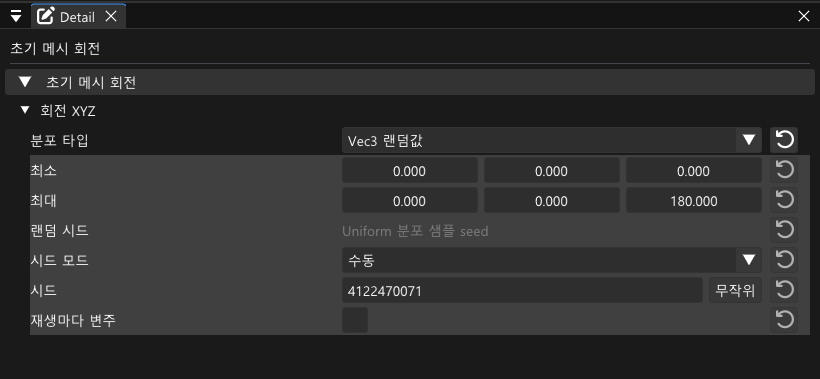

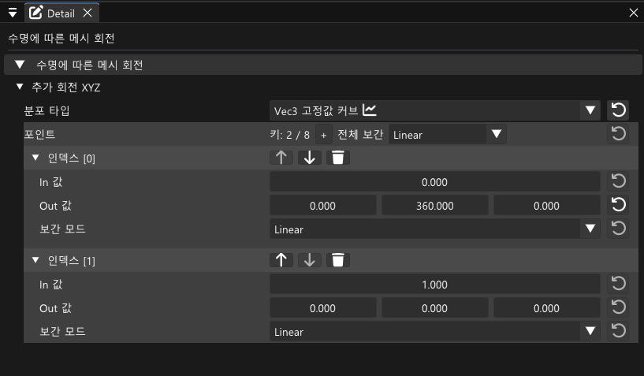

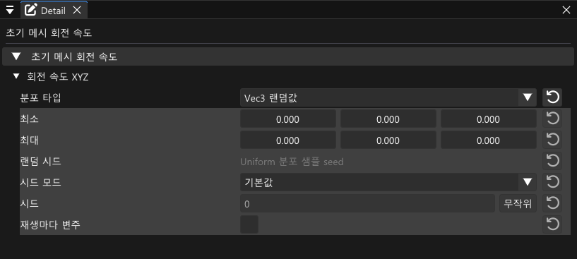

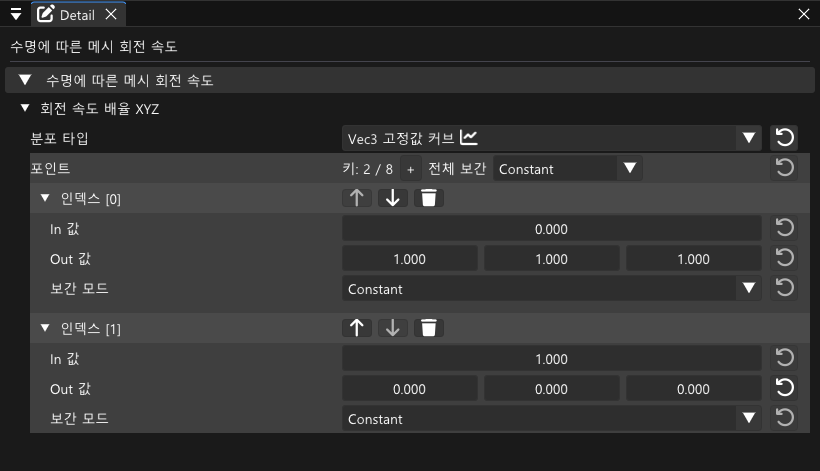

| Module | UI 이름 | 의미 | 값 해석 | 분포/시간축 | 주의점 |
| --- | --- | --- | --- | --- | --- |
| `초기 메시 회전` | `회전 XYZ` | 생성 시점 mesh XYZ 회전이다. | degree 축별 회전이다. | Vec3 분포 | Mesh TypeData 전용이다. |
| `수명에 따른 메시 회전` | `추가 회전 XYZ` | lifetime 동안 더할 mesh XYZ 회전이다. | degree 축별 추가 회전이다. | Vec3 분포/curve | Mesh TypeData 전용이다. |
| `초기 메시 회전 속도` | `회전 속도 XYZ` | mesh XYZ 회전 속도다. | 축별 degree/sec 계열로 읽는다. | Vec3 분포 | Mesh TypeData 전용이다. |
| `초기 메시 회전 속도` | `월드 스페이스` | 회전 속도 축의 기준을 정한다. | 켜면 world axis, 끄면 기존 mesh Euler/local axis 기준이다. | bool | 초기 메시 보정 뒤에도 world 축으로 돌리고 싶을 때 켠다. |
| `수명에 따른 메시 회전 속도` | `회전 속도 배율 XYZ` | lifetime 동안 회전 속도 배율을 바꾼다. | 축별 multiplier다. | Vec3 분포/curve | Mesh TypeData 전용이다. |

### 6.13 컬러 Module

컬러 Module은 RGB와 alpha를 분리해서 읽어야 한다.

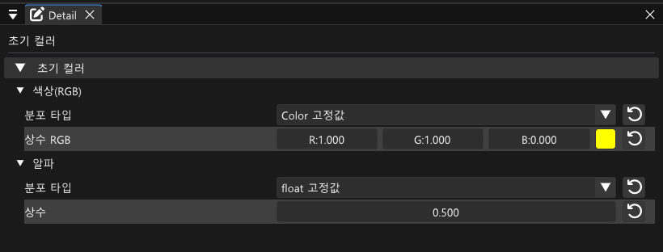

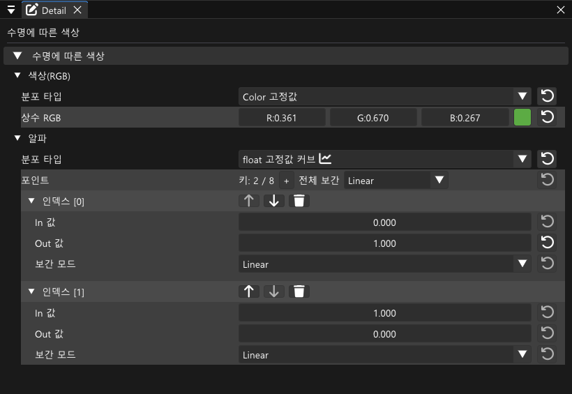

| Module | UI 이름 | 의미 | 값 해석 | 분포/시간축 | 주의점 |
| --- | --- | --- | --- | --- | --- |
| `초기 컬러` | `색상(RGB)` | 생성 시점 RGB다. | 흰색은 원본 texture 색을 유지하는 쪽이다. | Color RGB 분포 | alpha는 별도 field다. |
| `초기 컬러` | `알파` | 생성 시점 alpha다. | 1은 불투명, 0은 투명 방향이다. | float 분포 | effect가 안 보이면 먼저 확인한다. |
| `수명에 따른 색상` | `색상(RGB)` | lifetime에 따른 RGB multiplier다. | 시간에 따라 색을 바꾼다. | Color RGB 분포/curve | Material color와 곱해질 수 있다. |
| `수명에 따른 색상` | `알파` | lifetime에 따른 alpha multiplier다. | fade in/out을 만든다. | float 분포/curve | 색상 변화와 독립적으로 alpha fade를 잡는다. |

### 6.14 서브UV 프레임 선택/재생

`서브UV 프레임 선택/재생`은 texture atlas frame을 고르거나 재생한다.

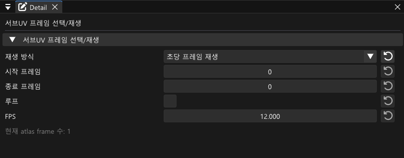

주로 쓰는 TypeData: Sprite, Ribbon, Sprite Trail, Beam. Mesh/Trail에서는 TypeData 호환성을 Module picker에서 먼저 확인한다.

| UI 이름 | 의미 | 값 해석 | 분포/시간축 | 주의점 |
| --- | --- | --- | --- | --- |
| `재생 방식` | frame 선택 방식이다. | FixedFrame, LifeProgress, FramesPerSecond, RandomFrame 계열이다. | combo | 방식에 따라 표시 field가 달라진다. |
| `프레임` | 고정 frame index다. | FixedFrame에서 사용할 atlas frame이다. | uint 고정값 | 현재 atlas frame 수 안으로 clamp된다. |
| `시작 프레임` | frame 범위 시작이다. | LifeProgress/FPS/RandomFrame 범위 시작이다. | uint 고정값 | atlas frame 수 안으로 clamp된다. |
| `종료 프레임` | frame 범위 끝이다. | frame 재생/랜덤 범위 끝이다. 시작보다 작으면 atlas 끝을 거쳐 0번부터 이어진다. | uint 고정값 | atlas frame 수 안으로 clamp된다. |
| `루프` | FPS 재생 반복 여부다. | 켜면 해석된 frame range 안에서 반복 재생한다. | bool | wrap range에서도 같은 range 안에서 반복된다. |
| `FPS` | 초당 frame 진행 수다. | 값이 높을수록 빠르게 재생한다. | float 고정값 | 0 이상으로 정규화된다. |
| `개체별 랜덤 시작` | FPS 재생의 시작 phase를 개체별로 다르게 한다. | Sprite는 particle, Sprite Trail은 stamp, Beam은 strip, SourceHistoryRibbon은 replay/loop 단위로 해석한다. | bool | RandomFrame이 아니라 순차 FPS 재생의 시작 위치만 바꾼다. |
| `랜덤 시드` | RandomFrame 또는 개체별 랜덤 시작 seed다. | frame 선택 또는 FPS 시작 phase 랜덤성을 재현한다. | seed UI | RandomFrame 또는 `개체별 랜덤 시작`이 켜진 FPS에서 사용한다. |
| `현재 atlas frame 수` | Required material/texture에서 해석한 atlas frame count다. | frame index clamp 기준이다. | read-only | frame 수가 0이면 원하는 결과가 안 나올 수 있다. |

Sprite Trail에서도 frame 선택, random frame, frame over life 정책은 TypeData가 아니라 `서브UV 프레임 선택/재생` Module이 소유한다. 2x2 번개 sprite sheet처럼 frame을 바꿔 찍는 경우에도 먼저 이 Module을 확인한다.

### 6.15 거리당 스폰

`거리당 스폰`은 이동 거리 기준으로 sample 또는 spawn 밀도를 제어한다. Trail 계열 authoring에서 특히 중요하다.

주로 쓰는 TypeData: Trail. Sprite의 일반 spawn rate와 구분한다. Sprite Trail은 TypeData의 `스탬프 간격` / `스탬프 시간 간격`으로 stamp 생성 밀도를 정하므로, `거리당 스폰`을 Sprite Trail stamp 생성 owner로 보지 않는다.

| UI 이름 | 의미 | 값 해석 | 분포/시간축 | 주의점 |
| --- | --- | --- | --- | --- |
| `분포` | 거리당 생성 밀도다. | 이동 거리 대비 sample/particle 밀도를 정한다. | float 분포 | Trail sample density로 이해한다. |
| `단위 스칼라` | 분포 값을 world distance로 환산하는 기준이다. | 작을수록 같은 분포 값이 더 촘촘해질 수 있다. | float 고정값 | 0.0001 이상으로 정규화된다. |
| `무브먼트 허용치` | 너무 작은 이동을 무시하는 threshold다. | 이 거리 미만의 provider 이동은 새 history sample로 받지 않는다. | float 고정값 | 0 이상으로 정규화된다. |
| `최대 프레임 거리` | 한 frame 이동의 최대 허용 거리다. | 초과하면 teleport/skip으로 보고 history를 재시드한다. | float 고정값 | 0 이하면 제한 없음으로 표시된다. |

### 6.16 스프라이트 트레일 경로 Module

`Path Follow`와 `Path Replay`는 `스프라이트 트레일 데이터` 전용 Module이다. TypeData가 stamp를 어디에 얼마나 찍을지 정한다면, 이 두 Module은 생성된 stamp가 source history path 위에서 어떻게 움직일지 정한다.

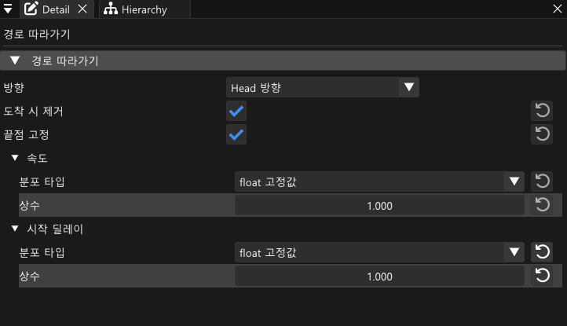

`Path Follow`는 stamp가 생성 시점의 tangent 방향으로 직선 이동하는 대신, source history path 위 좌표를 따라 움직이게 한다.

| UI 이름 | 의미 | 값 해석 | 분포/시간축 | 주의점 |
| --- | --- | --- | --- | --- |
| `방향` | path 좌표 진행 방향이다. | `Head 방향`은 최신 source/head 쪽, `Tail 방향`은 과거 path/tail 쪽으로 이동한다. | combo | 기본 흡수 연출은 보통 `Head 방향`으로 시작한다. |
| `도착 시 제거` | 끝점에 도착한 stamp를 제거할지 정한다. | 켜면 도착한 stamp가 사라진다. | bool | 꺼져 있으면 `끝점 고정` 여부를 함께 본다. |
| `끝점 고정` | 제거하지 않을 때 끝점에 고정할지 정한다. | 켜면 도착 위치에 머문다. | bool | 꺼져 있으면 도착 후 표시가 유지되지 않을 수 있다. |
| `속도` | path distance 기준 이동 속도다. | 값이 클수록 path 위를 빠르게 따라간다. | float 분포/curve | 일반 velocity가 아니라 path 좌표 진행 속도다. |
| `시작 딜레이` | 생성 후 path-follow 시작 전 대기 시간이다. | stamp별로 따라가기 시작 시점을 늦춘다. | float 분포/curve | delay 중에도 stamp life는 별도로 진행될 수 있다. |

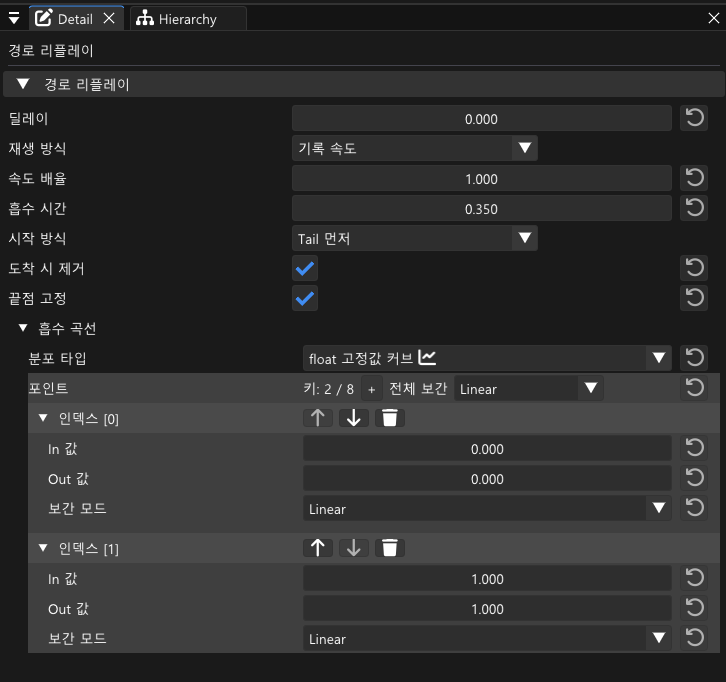

`Path Replay`는 일정 시간 유지된 stamp가 source history 기록을 따라 head 쪽으로 따라붙는 흡수형 연출에 사용한다.

| UI 이름 | 의미 | 값 해석 | 분포/시간축 | 주의점 |
| --- | --- | --- | --- | --- |
| `딜레이` | replay 시작 전 유지 시간이다. | stamp 생성 후 이 시간 동안 path replay를 기다린다. | float 고정값 | 흡수 시작 타이밍을 늦출 때 사용한다. |
| `재생 방식` | path replay 진행 기준이다. | `기록 속도`는 source history의 기록 속도, `지정 시간`은 지정된 총 시간 기준이다. | combo | 연출 의도에 따라 둘 중 하나를 고른다. |
| `속도 배율` | 기록 속도 모드의 배율이다. | source 기록 속도에 곱해진다. | float 고정값 | `기록 속도` 모드에서 주로 체감된다. |
| `흡수 시간` | 지정 시간 모드의 총 drain 시간이다. | head까지 따라붙는 전체 시간을 정한다. | float 고정값 | `지정 시간` 모드에서 주로 체감된다. |
| `시작 방식` | replay 시작 순서다. | `Tail 먼저`는 끝쪽부터, `동시 시작`은 전체 stamp가 함께 시작한다. | combo | tail이 접히는 느낌을 만들 때 `Tail 먼저`를 사용한다. |
| `도착 시 제거` | head 도착 시 stamp를 제거할지 정한다. | 켜면 도착한 stamp가 사라진다. | bool | `수명에 따른 크기`, `수명에 따른 색상`과 함께 조정한다. |
| `끝점 고정` | 제거하지 않을 때 끝점에 고정할지 정한다. | 켜면 head 위치에 머문다. | bool | 제거하지 않는 연출에서만 의미가 크다. |
| `흡수 곡선` | 지정 시간 모드의 진행률 curve다. | 0~1 진행률을 curve로 보정한다. | float curve | 빠르게 빨려 들어가거나 뒤늦게 따라붙는 느낌을 만든다. |

`Path Replay`가 있으면 `Path Follow`보다 우선한다. 둘은 동시에 stamp 위치 진행을 소유하는 Module이 아니므로, 같은 Sprite Trail Emitter에서는 한쪽 경로 정책만 기준으로 잡는다.

### 6.17 머티리얼 변조

`머티리얼 변조`는 Material parameter를 시간에 따라 바꾸는 Module이다. 현재는 scalar target, `Core Color RGB` color target, UV offset Vec2 target, UV Scroll Speed Scale target을 다룬다.

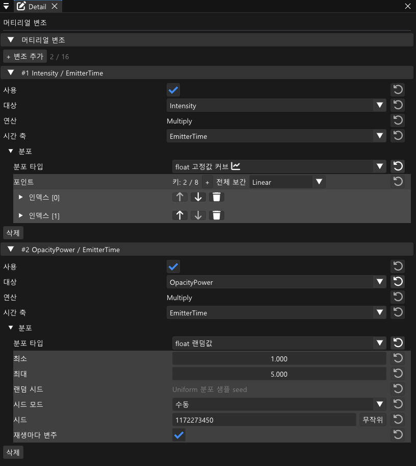

주로 쓰는 TypeData: Sprite, Mesh, Trail, Ribbon, Beam. `ParticleLife` 시간 축은 Sprite, SourceHistorySpriteTrail, Trail, Ribbon, Beam, Mesh의 scalar target과 `Core Color RGB`에서 지원한다. Vec2 UV offset target과 UV Scroll Speed Scale target은 `EmitterTime` 기준으로 쓴다.

| UI 이름 | 의미 | 값 해석 | 분포/시간축 | 주의점 |
| --- | --- | --- | --- | --- |
| `+ 변조 추가` | 기본 scalar row를 추가한다. | 처음에는 Intensity target으로 생성된다. | float 분포 / EmitterTime | 다른 target 종류는 row 내부 `대상` 콤보에서 바꾼다. |
| `변조 사용` | 해당 modulator 적용 여부다. | 꺼진 row는 변조하지 않는다. | bool | Module row enabled와 별개다. |
| `대상` | 변조할 material field다. | scalar, `Core Color RGB`, Main/Noise/Mask/Flow UV Offset, Main/Noise/Mask/Flow UV Scroll Speed Scale 중 선택한다. | combo | category를 바꾸면 row 종류가 바뀌고 분포 값은 새 기본값으로 초기화된다. |
| `연산` | scalar 값을 material 값에 적용하는 방식이다. | 현재 UI는 label만 표시하고 reset할 수 있다. | read-only/action | 확정 동작은 runtime material lowering 기준으로 확인한다. |
| `시간 축` | 변조 분포를 평가할 시간 기준이다. | `EmitterTime` 또는 지원되는 경우 `ParticleLife`다. | combo | `ParticleLife`는 허용 scalar target과 `Core Color RGB`에서 particle/stamp/sample/segment/instance life 기준으로 평가된다. Scroll Speed Scale은 EmitterTime으로 보정된다. |
| `분포` | 시간에 따른 변조 값이다. | scalar row는 float, Core Color RGB row는 적용할 RGB Vec3, Vec2 row는 X/Y channel이다. Core Color RGB의 `Uniform + ParticleLife`는 개체 생성 시점에 min/max 범위에서 한 색을 샘플하고 life 동안 유지한다. `ConstantCurve + ParticleLife`는 life 진행도에 따라 색을 평가한다. | float/Vec3/Vec2 분포 | Beam은 EmitterTime 기준으로 보는 것이 안전하다. |
| `삭제` | 해당 modulator row를 제거한다. | row 구조를 바꾼다. | editor action | 삭제 후 같은 parameter 변조가 사라진다. |

Material Instance View에서 기본 parameter를 정하고, `머티리얼 변조` Module에서 시간 변화 규칙을 얹는다고 이해하면 된다. `Core Color RGB` row는 core color RGB 값을 적용하거나 시간에 따라 바꾸는 color row이고, 밝기 배율처럼 기존 core color에 곱할 값은 scalar target인 `CoreColor Multiplier`로 다룬다. UV Offset target은 base offset에 Vec2 값을 더하고, UV Scroll Speed Scale target은 Material Instance의 base scroll speed에 scalar 값을 곱한다. Scroll Speed Scale은 `1.0`이면 원래 속도, `0.0`이면 정지, `-1.0`이면 반대 방향이며, shader가 `scrollSpeed * materialTime`으로 UV를 만들기 때문에 급격한 scale 변화는 누적 감속이 아니라 phase jump처럼 보일 수 있다.

Material Instance Preview는 emitter 문맥이 있으면 `Required.duration` 기준으로 material time과 변조 phase를 반복한다. standalone material preset preview처럼 emitter 문맥이 없는 경우에는 1초 주기 fallback으로 보여준다. 이 preview는 material surface 확인용이므로 particle lifetime, spawn, loop module 전체를 재현하는 정본은 Scene View preview로 본다.

### 6.18 Type 호환성 메모

모든 Module이 모든 TypeData에 의미 있는 것은 아니다. 호환성은 Module picker에서 먼저 확인한다.

- Sprite 계열은 대부분의 particle Module을 사용할 수 있다.
- Mesh TypeData는 mesh 전용 transform Module을 우선 사용한다.
- Trail은 sample/history 기반 동작이므로 `거리당 스폰`과 Trail TypeData를 함께 본다.
- Ribbon/Beam은 strip/path 기반 타입이므로 source/path 의미가 없는 spawn shape Module은 비호환일 수 있다.
- Sprite Trail은 source history 기반 stamp 타입이므로 `Path Follow` / `Path Replay` 같은 전용 경로 Module을 사용할 수 있다.
- `Path Follow`와 `Path Replay`는 `Sprite Trail TypeData 전용`이며, 같은 Emitter에서 동시에 쓰는 진행 owner가 아니다.
- `필수`, `수명`, `초기 컬러`, `수명에 따른 색상`, `수명에 따른 크기`, `머티리얼 변조`처럼 여러 타입에서 공통으로 쓰이는 Module도 있다.

## 7. Material Editing

Material 편집은 Required Module, Material Instance View, `머티리얼 변조`를 구분해서 봐야 한다.

### 7.1 Required Module Material

Required Module 안의 Material 영역은 Emitter가 사용할 material authoring data의 출발점이다. 이 값은 Emitter-local copy로 저장된다. 따라서 source material asset을 선택하더라도, 실제 Emitter가 들고 있는 embedded material instance 값을 별도로 편집할 수 있다.

### 7.2 Material Instance View

Material Instance View는 material instance 값을 자세히 편집하는 창이다.

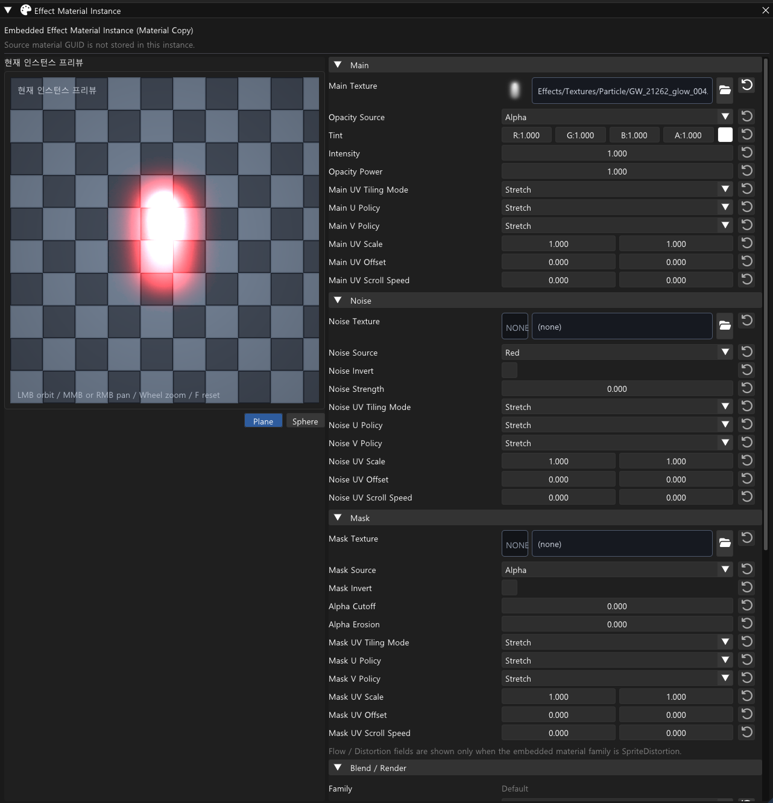

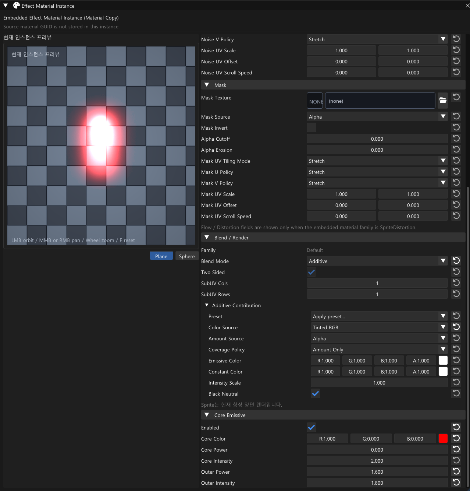

이 창에서는 texture reference, scalar/vector/color parameter, preview surface를 확인한다. Content Browser에서 texture를 drag/drop하거나 파일 선택 버튼으로 texture를 지정할 수 있다.

Texture slot은 공통으로 thumbnail, drop area, folder browse, reset action을 가진다. texture를 지정하면 asset GUID를 우선 저장하고, resolve가 실패할 때 확인용 path가 fallback/debug hint로 남는다.

| 공통 조작 | 의미 | 주의점 |
| --- | --- | --- |
| thumbnail | 현재 slot에 연결된 texture를 미리 본다. | 비어 있거나 로드 실패 상태면 fallback 표시가 날 수 있다. |
| drag/drop | Content Browser의 texture를 slot에 바로 넣는다. | effect texture는 PNG/DDS 계열 resource를 기준으로 본다. |
| folder browse | 파일 선택 창으로 texture를 지정한다. | 같은 slot에 새 texture를 넣으면 기존 reference를 교체한다. |
| reset | 해당 slot 값을 기본값으로 되돌린다. | reset은 source material asset을 수정하지 않고 embedded copy만 바꾼다. |

Material Instance View의 주요 section은 다음처럼 읽으면 된다.

| Section | UI 이름 | 의미 | 값 해석 | 주의점 |
| --- | --- | --- | --- | --- |
| `Main` | `Main Texture` | effect의 기본 색/opacity source가 되는 주 texture다. | sprite effect 경로에서는 lit base color보다 emissive-like color와 opacity source로 해석한다. | main texture가 비면 대부분의 preview가 의도대로 보이지 않는다. |
| `Main` | `Opacity Source` | main texture에서 opacity를 뽑는 방식이다. | `Alpha`, `Red`, `Luminance` 중 선택한다. | channel-packed texture를 쓸 때는 실제 opacity channel과 맞춰야 한다. |
| `Main` | `Tint` | main texture RGB에 곱하는 색상 계수다. | RGB는 색, A는 alpha 계열 값으로 본다. | texture 자체를 바꾸지 않고 instance copy의 색만 조정한다. |
| `Main` | `Intensity` | sprite 밝기/발광감 계수다. | 1이 기본이고 커질수록 더 강해진다. | blend mode와 alpha 값에 따라 체감이 달라진다. |
| `Main` | `Opacity Power` | opacity source를 sharpen/soften하는 계수다. | 1이 기본이다. | 너무 크면 edge가 급격히 딱딱해질 수 있다. |
| `Main` | `Main UV Tiling Mode` | main texture UV를 어떻게 반복/늘림/고정할지 정한다. | `Wrap`, `Stretch`, `Clamp`, `Raw` 중 선택한다. | U/V policy를 따로 바꾸면 표시용 tiling mode가 compatible 값으로 갱신될 수 있다. |
| `Main` | `Main U Policy`, `Main V Policy` | U축과 V축의 UV 해석을 따로 정한다. | 각 축별 `Wrap`, `Stretch`, `Clamp`, `Raw`다. | Trail/strip 계열에서는 축별 정책이 반복 방향을 가른다. |
| `Main` | `Main UV Scale` | main texture UV 배율이다. | X/Y가 U/V scale이다. | `Stretch` 계열에서는 renderer 해석에 따라 체감이 달라질 수 있다. |
| `Main` | `Main UV Offset` | main texture UV 시작 위치를 민다. | X/Y가 U/V offset이다. | 정적 이동값이고 시간 변화는 `Scroll Speed`가 담당한다. |
| `Main` | `Main UV Scroll Speed` | main texture UV의 시간당 이동 속도다. | X/Y가 U/V scroll speed다. | preview 시간 기준으로 계속 움직인다. |
| `Noise` | `Noise Texture` | main 결과를 흔들거나 깎는 보조 scalar texture다. | 선택 slot이다. | 비어 있으면 noise 효과 없이 계속 preview된다. |
| `Noise` | `Noise Source` | noise texture에서 scalar를 뽑는 방식이다. | `Alpha`, `Red`, `Luminance` 중 선택한다. | noise texture의 실제 채널 packing과 맞춰야 한다. |
| `Noise` | `Noise Invert` | noise scalar를 뒤집는다. | `1 - x`로 해석한다. | erosion 방향이 반대로 보일 수 있다. |
| `Noise` | `Noise Strength` | noise가 material 결과에 끼치는 강도다. | 0이면 사실상 noise 영향이 없다. | texture가 있어도 strength가 0이면 변화가 보이지 않는다. |
| `Noise` | `Noise UV *` | noise texture 전용 tiling, axis policy, scale, offset, scroll speed다. | `Main UV *`와 같은 방식으로 읽는다. | main texture와 다른 속도로 흐르게 할 때 사용한다. |
| `Mask` | `Mask Texture` | coverage/alpha를 제한하는 보조 texture다. | 선택 slot이다. | 비어 있으면 mask 없이 계속 preview된다. |
| `Mask` | `Mask Source` | mask texture에서 coverage를 뽑는 방식이다. | `Alpha`, `Red`, `Luminance` 중 선택한다. | mask texture의 channel packing과 맞춰야 한다. |
| `Mask` | `Mask Invert` | mask coverage를 뒤집는다. | `1 - x`로 해석한다. | 보이는 영역과 사라지는 영역이 바뀐다. |
| `Mask` | `Alpha Cutoff` | alpha cutoff 기준값이다. | 보통 0~1 범위로 본다. | MeshData Preview에서는 Required render policy가 read-only로 덮을 수 있다. |
| `Mask` | `Alpha Erosion` | mask/noise 기반 alpha erosion 양이다. | 보통 0~1 범위로 본다. | dissolve처럼 가장자리부터 깎는 느낌을 만들 때 쓴다. |
| `Mask` | `Mask UV *` | mask texture 전용 tiling, axis policy, scale, offset, scroll speed다. | `Main UV *`와 같은 방식으로 읽는다. | mask만 따로 고정하거나 흐르게 할 수 있다. |
| `Flow / Distortion` | `Flow Texture` | SpriteDistortion에서 screen UV offset source로 쓰는 texture다. | distortion family 전용 slot이다. | embedded material family가 `SpriteDistortion`일 때만 표시된다. |
| `Flow / Distortion` | `Flow UV *` | flow texture 전용 tiling, axis policy, scale, offset, scroll speed다. | `Main UV *`와 같은 방식으로 읽는다. | distortion 방향과 흐름을 조정한다. |
| `Flow / Distortion` | `Refraction Intensity` | screen UV offset 강도다. | 값이 클수록 화면 굴절이 강해진다. | 너무 크면 preview에서 형태가 찢겨 보일 수 있다. |
| `Flow / Distortion` | `Refraction Presence` | refraction 영향도를 켜고 줄이는 scalar다. | 0에 가까울수록 영향이 약하다. | texture가 있어도 presence가 낮으면 변화가 작다. |
| `Flow / Distortion` | `Shape Mode` | distortion이 적용될 card-local 영역을 고른다. | `None`, `Radial`, `Ring`, `ShockwaveRing` 계열이다. | Mesh Distortion v0처럼 shape 미지원 consumer에서는 read-only 안내가 뜰 수 있다. |
| `Flow / Distortion` | `Shape Radius`, `Shape Thickness`, `Shape Softness` | shape의 반경, 폭, falloff를 정한다. | Ring은 UV 기준, `ShockwaveRing`의 thickness/softness는 px 기준이다. | mode에 따라 일부 field만 표시된다. |
| `Blend / Render` | `Family` | material shader/pass family다. | `Default`, `SpriteDistortion` 같은 상위 분류다. | 어떤 section이 표시되는지에도 영향을 준다. |
| `Blend / Render` | `Render Policy Source` | render policy를 누가 정하는지 보여준다. | `Required` 또는 assigned material 쪽 source다. | MeshData Preview에서는 Required Module 값이 `Blend Mode`, `Alpha Cutoff`를 덮을 수 있다. |
| `Blend / Render` | `Blend Mode` | effect material 합성 방식이다. | `AlphaBlend`, `Additive`, `Masked` 등을 사용한다. | `Modulate`는 UI에 보여도 선택 불가일 수 있다. |
| `Blend / Render` | `Two Sided` | 양면 렌더 여부다. | mesh preview에서는 editable 값이다. | sprite renderer는 항상 양면이라 read-only 안내가 뜰 수 있다. |
| `Blend / Render` | `SubUV Cols`, `SubUV Rows` | atlas column/row 수다. | 1x1이 기본 단일 texture다. | SubUV module과 함께 볼 때 실제 frame 배치 기준이 된다. |
| `Additive Contribution` | `Preset` | additive contribution 조합을 빠르게 적용한다. | RGB, tinted, emissive, channel-packed, unmasked preset이 있다. | `Blend Mode`가 `Additive`일 때만 열린다. |
| `Additive Contribution` | `Color Source` | additive에 더할 색의 출처다. | `Main RGB`, `Tinted RGB`, `Emissive Color`, `Constant Color`다. | preset 적용 후 세부 값을 다시 조정할 수 있다. |
| `Additive Contribution` | `Amount Source` | additive 양을 결정하는 scalar 출처다. | `Alpha`, `Red`, `Luminance`, `Mask`, `One`이다. | `One`은 mask 없이 강하게 더하는 용도다. |
| `Additive Contribution` | `Coverage Policy` | coverage와 additive amount를 결합하는 방식이다. | `Amount Only`, `Coverage And Amount`, `Independent`다. | alpha coverage와 additive glow를 분리할지 정한다. |
| `Additive Contribution` | `Emissive Color`, `Constant Color`, `Intensity Scale`, `Black Neutral` | additive 색/강도/검정 처리 규칙이다. | color와 scalar/bool 조합이다. | additive가 과하면 먼저 intensity scale을 낮춘다. |
| `Core Emissive` | `Enabled` | alpha 기반 core/outer emissive shaping을 켠다. | bool이다. | 꺼져 있으면 아래 core 값이 preview에 드러나지 않는다. |
| `Core Emissive` | `Core Color` | 내부 core 색이다. | RGB만 편집한다. | alpha fade와 별개로 core 색감을 만든다. |
| `Core Emissive` | `Core Power`, `Core Intensity` | 내부 core의 집중도와 밝기다. | power는 shape, intensity는 밝기 계수다. | power가 높으면 중심부가 좁고 강해진다. |
| `Core Emissive` | `Outer Power`, `Outer Intensity` | 바깥 halo의 shape와 밝기다. | power는 falloff, intensity는 밝기 계수다. | outer가 과하면 전체 sprite가 뿌옇게 보일 수 있다. |

주의할 점은 Material Instance View가 source material asset 자체를 전역 수정하는 창이 아니라는 것이다. Required Module이나 MeshData가 가진 embedded material instance copy를 편집하는 consumer로 보는 편이 정확하다.

### 7.3 Color Picker

Color Picker popup은 color field를 직접 선택할 때 사용한다.

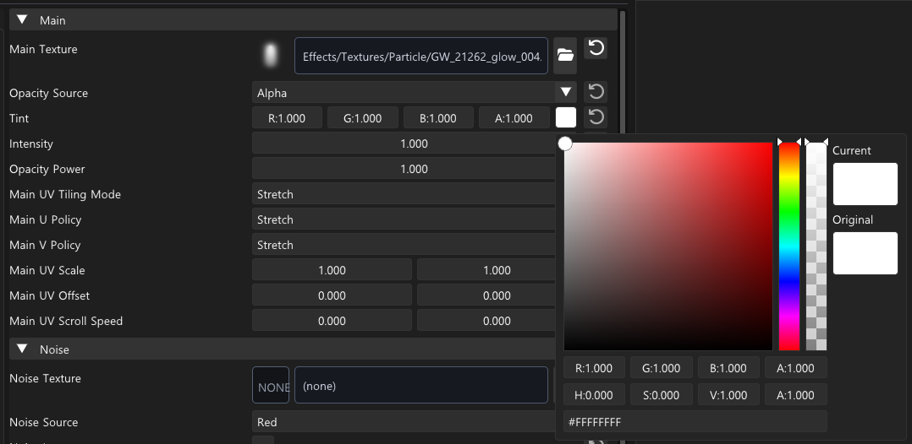

색상은 RGB와 alpha를 구분해서 봐야 한다. `초기 컬러`와 `수명에 따른 색상`은 색상 변화와 alpha fade를 함께 다룰 수 있으므로, effect가 너무 진하거나 보이지 않을 때 alpha 값도 같이 확인한다.

### 7.4 머티리얼 변조

`머티리얼 변조`는 material parameter 값을 시간에 따라 움직이게 하는 Module이다.

예를 들어 Material Instance View에서 `Alpha Erosion`, `Refraction Intensity`, UV Offset, UV Scroll Speed 같은 기본값을 정하고, `머티리얼 변조` Module에서 같은 parameter를 emitter time 기준으로 움직이게 할 수 있다. 이때 Material Instance View는 기본 상태를 정하고, Module은 시간 변화 규칙을 정한다고 이해하면 된다.

## 8. Mesh Data Preview

Mesh Data Preview는 Mesh TypeData에서 사용하는 model과 assigned material을 확인하는 전용 surface다.

### 8.1 Mesh TypeData Summary

Mesh TypeData의 Detail View에는 compact summary와 `MeshData 편집` 진입 버튼이 표시된다. 실제 model asset, material source, embedded material copy, validation summary는 Mesh Data Preview에서 더 자세히 다룬다.

### 8.2 Model Preview

Model Preview에서는 선택된 mesh asset을 확인한다.

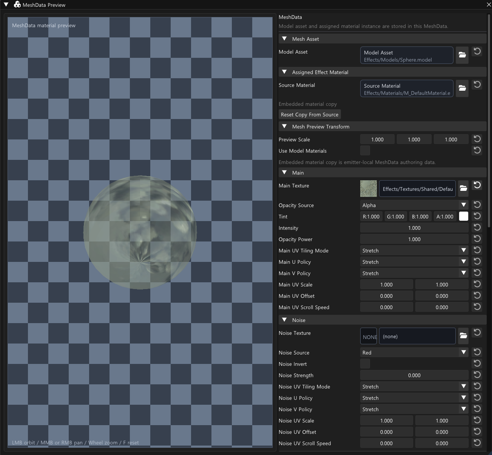

여기서는 model이 정상적으로 로드되는지, mesh slot이 기대한 형태인지, preview에서 material이 적용될 준비가 되어 있는지 본다.

Mesh Data Preview의 왼쪽 viewport는 model load 상태와 material preview 결과를 함께 보여준다. orbit/pan/zoom으로 형태를 확인하고, 오른쪽 inspector에서 source asset과 preview 전용 값을 조정한다.

| UI 이름 | 의미 | 값 해석 | 주의점 |
| --- | --- | --- | --- |
| `Model Asset` | MeshData가 사용할 `.model` source다. | Content Browser drag/drop 또는 folder browse로 지정한다. | model asset 자체를 수정하지 않고 MeshData의 reference만 바꾼다. |
| viewport | 선택 model에 assigned material을 입혀 보는 preview surface다. | model load 실패, shader/material missing 상태 메시지도 여기서 확인한다. | 보이는 결과는 preview renderer 기준이며 실제 runtime renderer와 완전히 같은 진단 surface는 아니다. |
| orbit/pan/zoom | preview camera 조작이다. | drag와 mouse wheel로 model을 돌려 보고 확대한다. | authoring data에는 저장되지 않는 보기 상태다. |
| `Preview Scale` | preview draw에만 쓰는 mesh scale이다. | X/Y/Z scale이며 기본 model asset을 변형하지 않는다. | 너무 작거나 크면 camera home 기준에서 보기 어려울 수 있다. |
| `Use Model Materials` | model 원본 material을 쓰는 debug fallback이다. | 켜면 MeshData material override 대신 model material 확인에 가깝다. | 기본 authoring은 MeshData embedded material copy를 model material slot에 override하는 흐름이다. |

### 8.3 Assigned Material Preview

Assigned Material Preview에서는 mesh에 연결된 effect material 상태를 확인한다.

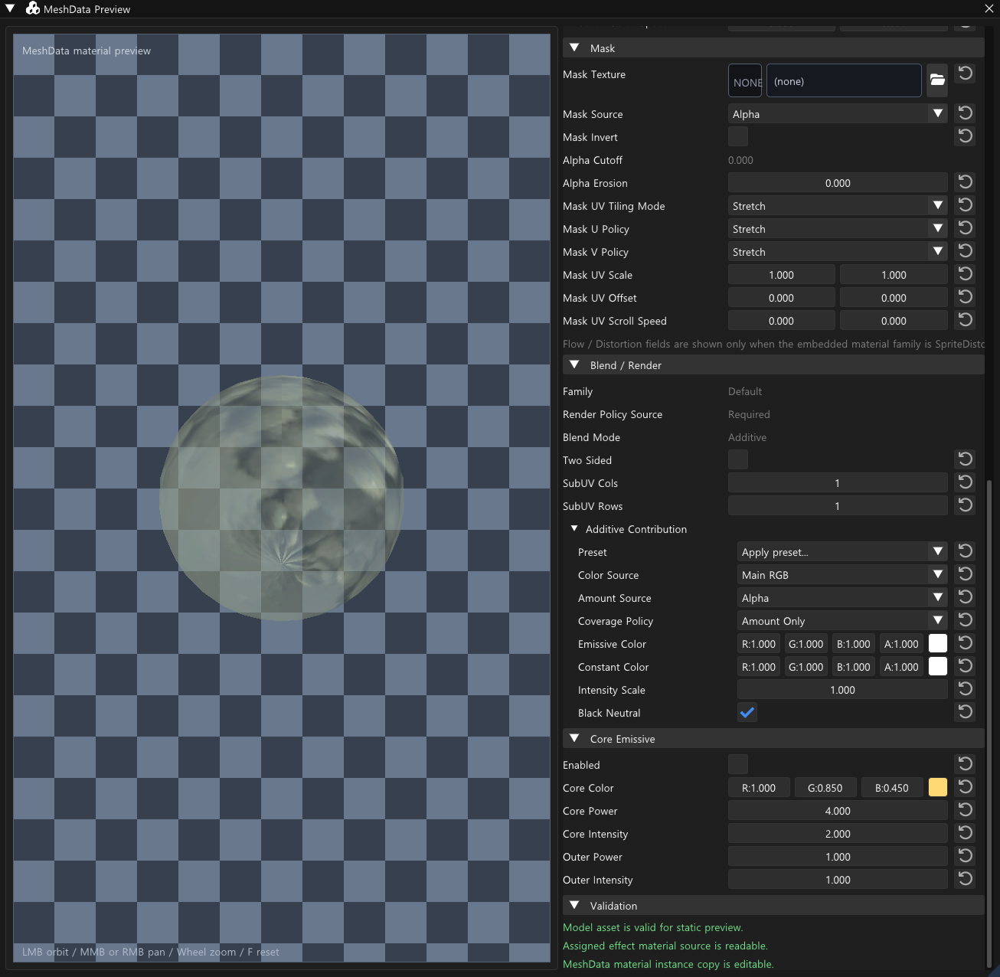

Mesh effect는 model과 material 둘 중 하나만 맞아도 완성되지 않는다. model asset이 정상이어도 material copy나 shader family가 맞지 않으면 preview 결과가 달라질 수 있다.

Assigned Material 영역은 source preset과 MeshData 내부 copy를 분리해서 봐야 한다.

| UI 이름 | 의미 | 값 해석 | 주의점 |
| --- | --- | --- | --- |
| `Source Material` | MeshData에 연결할 `.effectmaterial.json` preset이다. | Content Browser drag/drop 또는 folder browse로 지정한다. | source preset 선택만으로 전역 preset을 편집하는 것은 아니다. |
| `Embedded material copy` | source preset을 읽어 MeshData 안에 복사한 editable material instance다. | copy가 초기화된 뒤 아래 material instance field를 편집할 수 있다. | 이후 편집은 MeshData-local copy에 적용된다. |
| source reset/read action | 원본 `.effectmaterial.json`을 다시 읽어 embedded copy를 갱신한다. | 현재 copy를 source preset 값으로 덮어쓴다. | 이미 수동으로 조정한 값이 있으면 덮어쓰기 전에 의도를 확인한다. |
| material instance fields | `Material Instance View`와 같은 슬롯/수치 편집 surface다. | `Main`, `Noise`, `Mask`, `Flow / Distortion`, `Blend / Render`, `Core Emissive`를 같은 방식으로 읽는다. | MeshData Preview에서는 Required Module의 render policy가 일부 표시값을 read-only로 덮을 수 있다. |
| validation summary | model/source material/embedded copy 상태를 나눠 보여준다. | missing, readable, editable 여부를 구분한다. | model이 valid여도 material source나 embedded copy가 없으면 완성 상태가 아니다. |

## 9. Trail Preview Helpers

Trail preview helper는 Trail authoring을 돕기 위한 EffectEditor 전용 visualization tool이다.

motion sample, scale, spatial placement를 확인하는 데 사용하며, effect asset 자체에 저장되는 데이터로 보지 않는다.

### 9.1 Preview Object

Preview Object는 Trail sample이 어떤 움직임을 따라 생성되는지 확인하기 위한 대상이다.

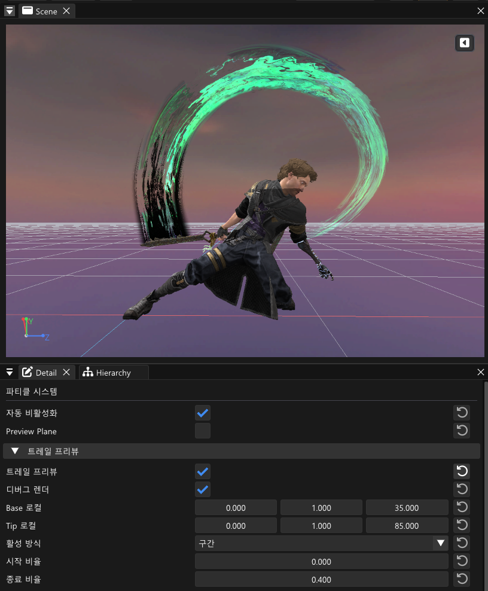

Detail View의 `트레일 프리뷰` 영역에서는 다음 값을 조정한다.

- `트레일 프리뷰`: preview object 표시 여부.
- `디버그 렌더`: base/tip marker와 보조 line 표시 여부.
- `프리뷰 속도`: editor preview fixture의 재생 속도.
- `Base 로컬`: Trail base sample의 weapon-local offset.
- `Tip 로컬`: Trail tip sample의 weapon-local offset.
- `Source 로컬`: Source History Sprite Trail source sample의 local offset.
- `활성 방식`: sample을 항상 받을지, Play 타임라인 구간에서만 받을지.
- `시작 비율` / `종료 비율`: Window 방식일 때 sample을 받는 구간.

Trail과 Source History Sprite Trail은 같은 preview fixture를 보지만 sample gate는 따로 조정할 수 있다. 이 값들은 Trail authoring을 위한 editor session 상태다. Trail TypeData의 저장 schema나 gameplay trail runtime contract와 혼동하지 않는다.

### 9.2 Preview Plane

Preview Plane은 Trail의 scale과 공간 배치를 확인하기 위한 기준면이다.

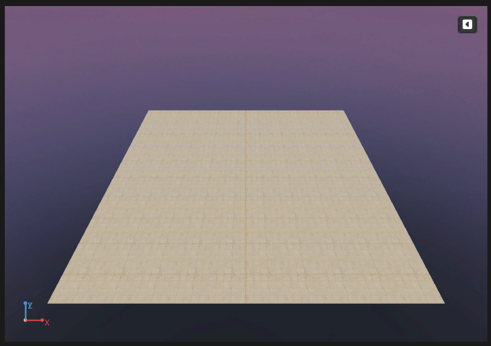

Preview Plane은 바닥 기준, 거리감, camera framing을 확인할 때 유용하다. 하지만 effect asset이 실제 runtime에서 plane object를 생성한다는 뜻은 아니다.

### 9.3 Editor-Only Boundary

Trail preview helper의 핵심 경계는 다음 한 문장으로 정리할 수 있다.

Trail TypeData와 Module 값은 저장되는 authoring data이고, Preview Object와 Preview Plane은 그 authoring data를 보기 위한 editor-only 관측 도구다.

이 경계를 놓치면 preview에서는 잘 보이는데 저장 후 gameplay에서 다르게 보이는 상황을 잘못 해석할 수 있다.

## 10. Curve Editor

Curve Editor는 `고정값 커브` 분포를 graph로 편집하는 창이다. Detail View 안에서도 key 목록을 직접 편집할 수 있지만, Curve Editor는 여러 channel을 시각적으로 보면서 key를 추가/선택/drag할 때 사용한다.

### 10.1 Curve를 사용하는 값

Detail View의 distribution field가 `float 고정값 커브`, `Vec2 고정값 커브`, `Vec3 고정값 커브`, `Color 고정값 커브`일 때 Curve Editor의 대상이 된다.

대표적인 curve 사용처는 다음과 같다.

- `수명에 따른 색상`.
- `수명에 따른 크기`.
- `수명에 따른 속도`.
- `수명에 따른 회전`.
- `수명에 따른 메시 크기/회전/회전 속도`.
- `서브UV 프레임 선택/재생`의 life progress 계열.
- `머티리얼 변조`.
- `Path Follow`의 `속도`, `시작 딜레이`.
- `Path Replay`의 `흡수 곡선`.
- Trail/Ribbon/Beam에서 시간 변화가 필요한 일부 값.

Curve Editor에 노출되는 대상은 Emitter id, Module id, Module type, property id, channel로 식별된다. 즉 같은 이름의 Module이 여러 Emitter에 있어도, 실제 track은 어느 Emitter의 어느 Module인지까지 포함해서 고정된다.

### 10.2 Track List

Track List는 현재 고정된 curve target 목록을 보여준다. Emitter View의 Module curve 버튼으로 target을 pin하면 Curve Editor가 그 Module의 curve field들을 수집한다.

Curve Editor에 아무 것도 보이지 않으면 다음을 확인한다.

- Detail View에서 해당 field가 curve mode인지.
- Emitter View의 Module curve 버튼으로 편집할 curve를 고정했는지.
- 현재 선택한 Module이 curve field를 가지고 있는지.

Track에는 active track이 있다. graph와 selected key inspector는 active track을 기준으로 편집된다. Vec2/Vec3/Color curve는 하나의 property 안에서도 channel이 나뉘어 보인다.

| payload | channel 예시 | 설명 |
| --- | --- | --- |
| Float | `Value` | 하나의 scalar curve다. |
| Vec2 | `X`, `Y` | size, scale 같은 2축 값을 channel별로 본다. |
| Vec3 | `X`, `Y`, `Z` | 위치, 속도, 메시 회전/크기 같은 3축 값을 channel별로 본다. |
| Color | `R`, `G`, `B` | RGB curve channel을 본다. Color curve key의 alpha는 현재 curve key normalize에서 1로 유지된다. |

### 10.3 Keys

Key는 curve의 특정 시간 위치와 값을 정의한다.

Detail View와 Curve Editor에서 자주 보이는 key 관련 용어는 다음과 같다.

| UI 이름 | 의미 | 코드 기준 동작 |
| --- | --- | --- |
| `In 값` | curve 입력 시간 또는 progress다. | key time은 0~1 범위로 clamp되고, key 목록은 time 기준으로 정렬된다. |
| `Out 값` | 해당 time에서 출력할 값이다. | Float/Vec2/Vec3/Color 타입에 따라 입력 UI가 다르다. |
| `보간 모드` | 이 key 이후 구간을 어떻게 보간할지 정한다. | Linear, Constant, Curve Auto Clamped가 현재 사용 가능하다. |
| `도착 탄젠트` | key로 들어오는 tangent다. | Curve Auto Clamped에서 주변 key 기준으로 자동 계산된다. |
| `출발 탄젠트` | key에서 나가는 tangent다. | Curve Auto Clamped에서 주변 key 기준으로 자동 계산된다. |

Key를 너무 적게 두면 변화가 단순해지고, 너무 많이 두면 조정이 어려워진다. 기본적인 fade나 size 변화는 시작/중간/끝 key 정도로 먼저 잡고 필요할 때 보강하는 것이 편하다.

Curve Editor graph에서는 key point를 클릭해서 선택하고, 선택된 key를 drag해서 time/value를 바꿀 수 있다. 빈 graph 영역을 클릭하면 현재 mouse 위치 기준으로 새 key를 추가한다. 새 key의 값은 현재 curve를 그 time에서 평가한 값으로 시작하므로, 기존 curve 형태를 크게 깨지 않고 key를 추가하기 쉽다.

### 10.4 Interpolation

Interpolation은 key 사이의 값을 어떻게 채울지 결정한다. 같은 key 위치와 값이라도 보간 방식에 따라 preview에서 보이는 속도감이 달라진다.

현재 기준으로 사용할 수 있는 보간은 다음과 같다.

| 보간 | 의미 | 사용 기준 |
| --- | --- | --- |
| `Linear` | key 사이를 직선으로 보간한다. | 가장 예측하기 쉬운 기본 보간이다. |
| `Constant` | 다음 key 전까지 이전 값을 유지한다. | frame index, 단계적 변화, 갑작스러운 on/off에 적합하다. |
| `Curve Auto Clamped` | 주변 key를 기준으로 부드러운 tangent를 자동 계산한다. | 부드러운 fade/scale 변화에 적합하다. |
| `Curve Auto (미구현)` | 자동 curve 후보지만 현재 비활성이다. | 사용하지 않는다. |
| `Curve User (미구현)` | 사용자 tangent curve 후보지만 현재 비활성이다. | 사용하지 않는다. |
| `Curve Break (미구현)` | 끊어진 tangent curve 후보지만 현재 비활성이다. | 사용하지 않는다. |

`전체 보간` combo는 현재 curve의 모든 key 보간을 한 번에 바꾼다. 일부 key의 보간이 다르면 `Mixed`로 보일 수 있다.

### 10.5 Lifetime Axis / Sampling

Curve Editor의 graph X축은 key의 `In 값`이며 현재 UI에서는 0~1 범위로 정규화된다. 다만 이 0~1이 무엇을 의미하는지는 Module과 TypeData에 따라 다르다.

| 상황 | X축 해석 |
| --- | --- |
| 일반 Over-Life Module | 대체로 normalized particle lifetime 기준으로 본다. |
| `수명` Module의 ConstantCurve | particle 생애 중간 변화가 아니라 spawn/loop 시점에 최대 수명을 샘플하는 용도다. |
| Beam `수명` | 전체 반복 순서 진행률로 각 loop의 visual life를 한 번 샘플한다. |
| `머티리얼 변조` + `EmitterTime` | Emitter time 기준으로 분포를 평가한다. |
| `머티리얼 변조` + `ParticleLife` | 허용 scalar target과 `Core Color RGB`를 particle/stamp/sample/segment/instance lifetime 기준으로 평가한다. `Core Color RGB Uniform`은 생성 시점 개체별 랜덤 색으로 고정되고, `ConstantCurve`는 life 동안 변화한다. |
| Trail/Ribbon source history 계열 | curve만이 아니라 source sample이 어떻게 쌓이는지도 결과에 영향을 준다. |
| Sprite Trail stamp 계열 | stamp age/lifetime 기준 변화와 source history path sampling을 구분해서 본다. |
| Sprite Trail `수명` ConstantCurve | stamp 생성 시점의 emitter loop 진행률로 stamp lifetime을 한 번 샘플한다. |
| Sprite Trail `Path Replay` 흡수 곡선 | `지정 시간` 모드에서 head로 따라붙는 진행률을 보정한다. |

따라서 curve가 기대와 다르게 보이면 `curve 모양`만 보지 말고, 그 curve가 어떤 시간 축에서 sampling되는지 확인해야 한다.

### 10.6 Detail 분포 UI와 Curve Editor의 관계

같은 curve는 두 위치에서 볼 수 있다.

- Detail View의 분포 UI: key 목록과 수치 입력을 직접 편집한다.
- Curve Editor: pinned track graph에서 key를 시각적으로 편집한다.

둘은 별도 데이터가 아니라 같은 authoring payload를 편집한다. Detail View에서 `고정값` 상태라면 Curve Editor에서 curve target으로 보이지 않을 수 있고, curve target으로 쓰려면 `고정값 커브`로 전환해야 한다. 일부 Module은 Emitter View의 curve 버튼이 고정 가능한 target을 찾아 `고정값 커브`로 변환해 pin할 수 있다.

### 10.7 실전 편집 메모

Curve가 적용되지 않는 것처럼 보일 때는 다음 순서로 확인한다.

1. field가 `고정값 커브` mode인지 확인한다.
2. 올바른 track을 보고 있는지 확인한다.
3. key의 `In 값` 범위가 유효한지 확인한다.
4. `Out 값`이 눈에 띄는 변화량인지 확인한다.
5. 보간 모드가 의도와 맞는지 확인한다.
6. 그 Module이 particle lifetime, emitter time, spawn-time sampling 중 무엇을 쓰는지 확인한다.
7. 필요한 경우 Restart Preview를 누른다.

## 11. Preview / Runtime Boundary

Preview는 effect authoring 결과를 확인하는 중요한 도구지만, runtime 전체와 완전히 같은 의미는 아니다.

### 11.1 Playback Controls

Play, Pause, Stop, Step은 preview runtime의 시간 진행을 제어한다. 이는 gameplay pause 정책을 편집하는 기능이 아니다.

Preview playback은 다음 용도로 사용한다.

- spawn timing 확인.
- lifetime 변화 확인.
- curve 변화 확인.
- SubUV playback 확인.
- Trail sample이 쌓이는 타이밍 확인.
- Beam/Ribbon strip 변화 확인.

Scene View의 viewport 크기 모드는 preview 관측용이다. `Manual`을 누르면 수동 viewport 크기 입력으로 전환되며 기본값은 1600 x 900이다. 이 값은 화면에서 effect framing을 확인하기 위한 editor setting이고 saved effect asset에 포함되지 않는다.

### 11.2 Restart Preview

Restart Preview는 현재 authoring data를 기준으로 preview effect를 다시 만든다.

다음 변경 뒤에는 Restart Preview가 필요할 수 있다.

- Emitter 추가/삭제.
- TypeData 추가/제거/초기화.
- Module 추가/삭제.
- Required Module의 resource/material 변경.
- Trail/Ribbon/Beam처럼 preview desc 구성이 달라지는 값 변경.

단순 color나 숫자 값은 즉시 반영되는 경우도 있지만, 헷갈리면 Restart Preview로 기준을 맞춘 뒤 다시 판단하는 편이 좋다.

### 11.3 저장되는 것

저장되는 것은 effect authoring data다.

저장 대상으로 보는 항목은 다음과 같다.

- Emitter 목록.
- Emitter enabled/name/id.
- TypeData payload.
- Module 목록과 Module payload.
- Required Module의 embedded material instance data.
- MeshData 안의 model/material authoring data.
- source reference id.

### 11.4 Editor-Only 상태

다음 항목은 effect asset 자체로 보지 않는다.

- View layout.
- Scene viewport overlay.
- Preview camera 상태.
- Trail preview object.
- Preview Plane.
- debug render helper.
- Trail preview gate와 marker 표시 같은 editor session helper.

### 11.5 Preview Lowering / Runtime Loading

EffectEditor preview와 Client runtime은 모두 저장된 authoring data를 소비하지만, 경로는 구분된다.

- EffectEditor preview는 authoring Emitter를 preview emitter definition으로 낮춰 Scene View에서 재생한다.
- Client runtime loader는 저장된 `.effect.json`을 읽고 runtime emitter definition으로 낮춘다.
- 두 경로는 같은 authoring data를 바라보지만, preview helper나 editor-only state까지 runtime asset data가 되는 것은 아니다.

따라서 preview에서 보이는 결과를 runtime에서 그대로 기대하려면, 저장되는 값과 editor-only helper를 구분해야 한다.

## 12. Troubleshooting

이 장은 사용 중 자주 헷갈리는 상황을 빠르게 확인하기 위한 체크리스트다.

### 12.1 Preview가 바뀌지 않을 때

다음을 확인한다.

- Restart Preview가 필요한 구조 변경인지.
- 선택한 Emitter/Module이 실제로 enabled 상태인지.
- Detail View에서 수정한 값이 현재 선택 대상의 값이 맞는지.
- curve field가 constant mode로 남아 있지 않은지.
- Material Instance View에서 수정한 값과 Module 변조 값이 서로 다른 값을 보고 있지 않은지.

### 12.2 Effect가 보이지 않을 때

다음을 우선 확인한다.

- Emitter enabled.
- Module enabled.
- `스폰` count/rate.
- `수명` 값.
- Required Module의 texture/material.
- alpha 값.
- Scene View camera 위치.
- TypeData와 Module 호환성.

### 12.3 Module을 추가할 수 없을 때

Module picker의 상태 문구를 확인한다.

- `이미 장착됨`이면 같은 타입 Module을 중복 추가할 수 없다.
- `현재 TypeData와 비호환`이면 현재 타입에서는 해당 Module이 소비되지 않는다.
- `Mesh TypeData 전용`은 비호환 사유가 Mesh 전용이라는 뜻이므로, 해당 Module을 쓰려면 Mesh TypeData를 추가해야 한다.
- `미구현`이면 아직 현재 버전에서 사용할 수 없는 항목이다.

### 12.4 Curve가 적용되지 않는 것처럼 보일 때

다음을 확인한다.

- field가 `고정값 커브`인지.
- Curve Editor에서 올바른 track을 보고 있는지.
- key의 `In 값`이 0~1 lifetime 범위 또는 해당 Module의 expected time range에 있는지.
- alpha나 size처럼 변화가 눈에 띄는 값인지.
- Restart Preview가 필요한 변경인지.

### 12.5 저장한 Effect가 다르게 보일 때

저장되는 authoring data와 editor-only helper state를 구분한다.

특히 다음은 저장 결과와 직접 동일시하지 않는다.

- Trail preview object.
- Preview Plane.
- Scene View overlay.
- debug render marker.
- preview camera framing.

저장 후 Client runtime에서 다르게 보인다면, 먼저 저장된 `.effect.json`에 필요한 Emitter/TypeData/Module 값이 들어갔는지 확인하고, 그 다음 preview lowering과 runtime loading 경계가 같은 값을 소비하는지 확인한다.
