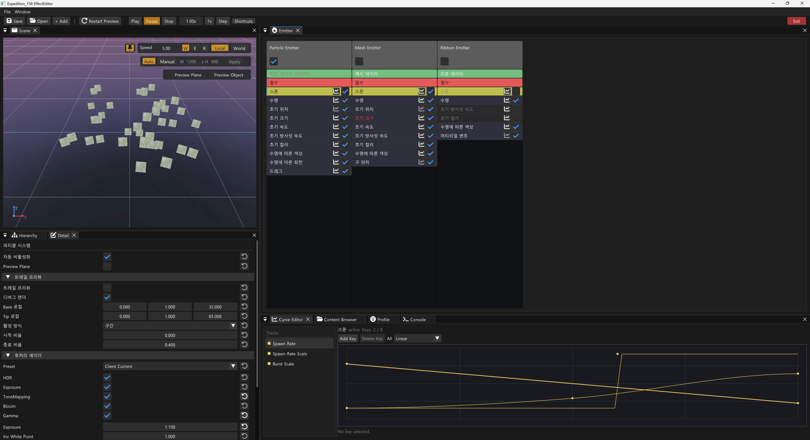
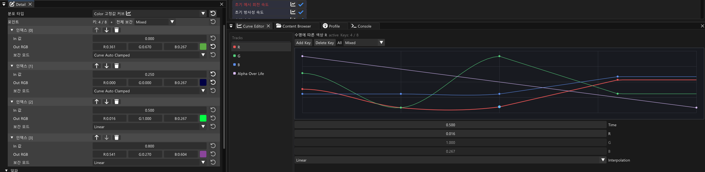
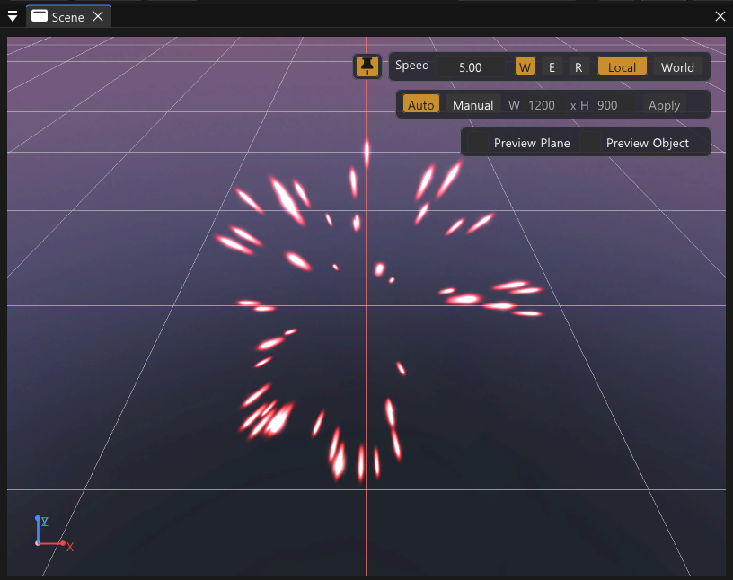
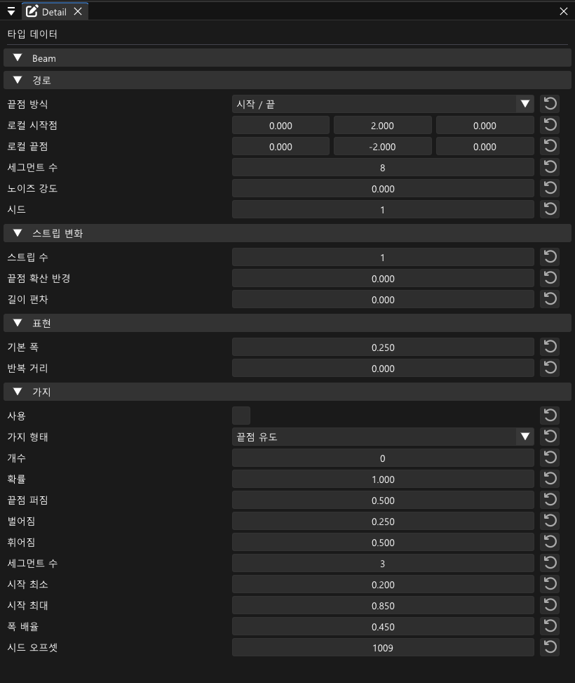

# Expedition 158 Effect System Portfolio

이 레포지토리는 팀 프로젝트 `Expedition_158`에서 제가 담당한 **이펙트 시스템**(GPU 파티클 런타임, 이미터, 이펙트 머티리얼, EffectEditor 툴, 에셋 파이프라인)의 코드를 포트폴리오 제출용으로 따로 추출한 저장소입니다.

원본 조직 레포지토리는 공유할 수 없기 때문에, 직접 구현한 코드와 그 코드가 실제 엔진 안에서 어떤 경로로 동작하는지 확인할 수 있는 최소한의 주변 코드만 원본 경로 구조 그대로 옮겼습니다. 빌드가 목적이 아닌 **코드 중심 추출본**이며, 의도적으로 빌드되지 않도록 프로젝트 파일과 엔진 공용 코드는 포함하지 않았습니다.

추출 기준 커밋: 원본 저장소 `3b4b0d5d2` (2026-09)

## 담당 범위

- **Compute-first GPU 파티클 런타임**: compute shader가 스폰·수명·이동을 시뮬레이션하고 indirect draw 인자까지 준비하는 구조. CPU는 스폰 요청과 cbuffer만 공급합니다.
- **이미터 6종**: `Sprite`, `Trail`, `SourceHistoryRibbon`, `SourceHistorySpriteTrail`, `Beam`, `Mesh`. 모두 `EffectEmitter` 공통 베이스를 상속하고 `EffectInstance`가 묶어서 재생합니다.
- **Cascade-style 모듈 에디터 (EffectEditor)**: Emitter → TypeData → Module 스택 구조, ImGui 기반 Detail View, Curve Editor, Undo/Redo, 프리뷰 런타임. Niagara식 노드 그래프는 의도적으로 범위 밖입니다.
- **이펙트 머티리얼 계약**: Additive/Translucent/Distortion/Glass 계열 머티리얼 패밀리, 스칼라·컬러 변조 curve, AirSheath 계열 트레일 머티리얼.
- **에셋 파이프라인**: 에디터 authoring 데이터를 `.effect.json`으로 저장하고, 클라이언트 런타임 로더가 같은 파일을 이미터 desc로 낮추는 양방향 경로.
- **게임플레이 연동**: 애님 노티파이(`ANS_*` / `AN_*`)에서 이펙트를 재생·정지하고, 뼈/파츠에서 트레일 샘플을 공급하는 provider 계층. ScreenFX 중 Flash / WorldDesaturate cue와 stencil 기반 제외 마스크.

## 구조

```text
EffectEditor authoring state
├─ AuthoringEmitter / AuthoringModuleData / TypeData
│  ├─ Detail_View / ModuleDetail_Drawers        : 선택된 payload를 편집하는 UI
│  └─ EffectMaterialInstance_View               : emitter-local 머티리얼 사본 편집
├─ EffectAuthoringJsonSerializer
│  └─ writes / reads  *.effect.json
├─ preview path
│  └─ EffectEditorPreviewRuntime
│       └─ EffectEditorPreviewDefinitionBuilder  : authoring → EffectDefinition 낮추기
└─ saved asset runtime path
   └─ Client::EffectAssetRuntimeLoader           : *.effect.json → EffectDefinition
        └─ Engine::EffectInstance
             └─ Client::EffectEmitterRegistration
                  ├─ ComputeSpriteEmitter        → VIBufferCom_ComputePointParticle → Shader_Compute_PointParticle
                  ├─ ComputeTrailEmitter         → Shader_Compute_TrailStrip
                  ├─ ComputeSourceHistoryRibbonEmitter → Shader_Compute_RibbonStrip
                  ├─ ComputeSourceHistorySpriteTrailEmitter
                  ├─ ComputeGeneratedBeamEmitter
                  └─ MeshEmitter
```

프리뷰 경로와 저장 에셋 경로는 서로 다른 lowering 코드를 거치지만 같은 `EffectDefinition` 계약으로 수렴합니다. 에디터에서 본 결과와 게임에서 본 결과가 갈라지지 않도록 하는 것이 이 구조의 핵심 목표였습니다.

## 주요 경로

| 경로 | 내용 |
| --- | --- |
| `Engine/Public`, `Engine/Private` | `EffectEmitter`, `EffectInstance`, `EffectEmitterFactory` 공통 베이스와 런타임 타입(`EffectRuntime_Types.h`, `Particle_Types.h`, `EffectMaterial_Types.h`), compute 파티클 버퍼(`VIBufferCom_ComputePointParticle`), compute shader / structured buffer 래퍼 |
| `Client/Public`, `Client/Private` | 이미터 6종 구현, `EffectCom`(오브젝트별 재생 컴포넌트), `EffectInstancePool`, `EffectAssetRuntimeLoader_*`(JSON → 런타임 desc), 트레일 샘플 provider, 애님 노티파이, ScreenFX cue |
| `Client/Bin/ShaderFiles` | 이펙트 draw 셰이더(`Shader_Effect*`), compute 셰이더(`Compute/`), 이펙트 머티리얼 공통 include. `Engine_Shader_*` 공통 include 7개는 컴파일 의존성 확인용으로만 포함 |
| `EffectEditor/` | 툴 전체 소스. `Public`/`Private`에 authoring 타입, JSON serializer, ImGui 패널, 프리뷰 런타임, Undo/Redo. `UserGuide.md`는 툴 사용 설명서 |
| `Client/Bin/Resources/Effects/Assets/Player` | 대표 이펙트 에셋 3개 (아래 참고) |
| `AGENTS.md`, `.codex/` | AI 코딩 에이전트 운용 규칙, 훅, 스킬 (아래 "AI 협업 방식" 참고) |
| `docs/records` | AI와 함께 정리한 문제 해결 기록 6편 |
| `docs/architecture` | 개인 C++ 헤더 구조·주석 기준 |

## 읽는 순서 추천

런타임 코어를 먼저 본 뒤 툴로 올라가는 순서를 권합니다.

1. [`Engine/Public/Particle_Types.h`](Engine/Public/Particle_Types.h) — GPU 인스턴스 레이아웃과 curve desc. 시스템 전체가 공유하는 데이터 계약
2. [`Engine/Private/VIBufferCom_ComputePointParticle.cpp`](Engine/Private/VIBufferCom_ComputePointParticle.cpp) — compute dispatch, indirect args, 파티클 lifecycle 버퍼 소유자
3. [`Client/Bin/ShaderFiles/Compute/Shader_Compute_PointParticle.hlsl`](Client/Bin/ShaderFiles/Compute/Shader_Compute_PointParticle.hlsl) — 스폰·수명·모듈 평가를 GPU에서 수행하는 본체
4. [`Client/Private/ComputeSpriteEmitter.cpp`](Client/Private/ComputeSpriteEmitter.cpp) — 이미터가 desc를 소비해 compute 경로를 구동하는 방식
5. [`Client/Bin/ShaderFiles/Shader_EffectSprite.hlsl`](Client/Bin/ShaderFiles/Shader_EffectSprite.hlsl) — 인스턴스 payload를 화면에 그리는 draw 셰이더
6. [`Client/Private/EffectAssetRuntimeLoader_Emitters.cpp`](Client/Private/EffectAssetRuntimeLoader_Emitters.cpp) — `.effect.json` 모듈을 런타임 desc로 낮추는 로더
7. [`EffectEditor/Private/EffectEditorPreviewDefinitionBuilder.cpp`](EffectEditor/Private/EffectEditorPreviewDefinitionBuilder.cpp) — 같은 일을 에디터 프리뷰 쪽에서 하는 builder
8. [`EffectEditor/Private/CurveEditor_View.cpp`](EffectEditor/Private/CurveEditor_View.cpp) — curve 편집 UI와 authoring payload의 연결

## EffectEditor



Emitter 목록, 모듈 스택, Detail View, Scene View 프리뷰를 한 화면에서 다루는 Cascade-style 툴입니다. 사용법과 각 모듈 설명은 [`EffectEditor/UserGuide.md`](EffectEditor/UserGuide.md)에 정리했습니다.

| Curve Editor | Scene View 프리뷰 | Beam TypeData |
| --- | --- | --- |
|  |  |  |

## 대표 에셋

`.effect.json` 저장 포맷과 이미터 조합을 확인할 수 있도록 플레이어 캐릭터별로 하나씩 골랐습니다. 셋을 합치면 이미터 6종이 모두 등장합니다.

- [`Gustave_Shatter_Slash_LargeTrail`](Client/Bin/Resources/Effects/Assets/Player/Gustave/Gustave_Shatter_Slash_LargeTrail.effect.json) — 대검 스킬. Trail 8개와 Ribbon, SourceHistorySpriteTrail, Sprite를 겹친 트레일 중심 구성
- [`Lune_SkyBreak_Beam`](Client/Bin/Resources/Effects/Assets/Player/Lune/Lune_SkyBreak_Beam.effect.json) — 하늘 파괴 스킬의 빔 단계. Beam 1개와 Sprite 21개
- [`Maelle_Pyrolyse_TripleSlash`](Client/Bin/Resources/Effects/Assets/Player/Maelle/Maelle_Pyrolyse_TripleSlash.effect.json) — 열분해 3연격. Mesh 8개, Ribbon 4개, Sprite 22개

## AI 협업 방식

이 프로젝트의 이펙트 파트는 AI 코딩 에이전트와 함께 진행했습니다. 코드 자체보다 **에이전트를 어떤 규칙으로 통제했는지**가 재현 가능한 부분이라 관련 파일을 그대로 포함했습니다.

- [`AGENTS.md`](AGENTS.md) — 에이전트가 세션마다 읽는 저장소 규칙. 승인 경계(Engine·공용 헤더·에셋 데이터는 사전 승인), 정본(source of truth) 우선 판단, 명명 규칙, 문서 수명주기(`docs/tasks/01_planned → 02_in-progress → 03_completed → 04_discarded`), 빌드 판단 기준을 짧게 고정했습니다.
- [`.codex/hooks.json`](.codex/hooks.json) + [`.codex/hooks/`](.codex/hooks) — 규칙을 텍스트로만 두지 않고 훅으로 강제했습니다. `session_start.py`는 가드레일을 컨텍스트로 주입하고, `user_prompt_submit.py`는 프롬프트를 `review_only` / `docs_only` / `plan_first` / `approval_sensitive` 같은 모드로 분류해 힌트를 붙이며, `pre_tool_use.py`는 파괴적 git 명령·재귀 삭제·데이터 테이블 직접 수정을 거부하고 공용 셰이더는 원본과 사본을 같은 턴에 읽기 전에는 쓰지 못하게 막습니다. `managed_workspace.py`는 IDE 잠금으로 빌드 검증이 막힐 때 쓰는 격리 빌드 슬롯입니다.
- [`.codex/skills/`](.codex/skills) — 반복 작업을 스킬로 묶은 예 2개. git index lock 정리, 완료 문서를 팀 Notion DB에 등록하는 절차.
- 작업 단위마다 계획 문서를 먼저 쓰고 승인 후 구현·검증·완료 문서로 닫는 흐름을 유지했습니다. 이 저장소의 주석 정리 같은 마무리 작업도 같은 방식으로 처리했습니다.

### 문제 해결 기록

원인 → 검토한 대안 → 결정 → 배운 점 → 한계 순서로, AI와 함께 정리한 기록입니다. 각 문서 상단에 인용된 계획 문서는 이 저장소에 포함하지 않았습니다.

- [compute_sprite_spawn_seed_determinism_debugging](docs/records/compute_sprite_spawn_seed_determinism_debugging.md) — Restart마다 random이 흔들린 원인은 seed가 아니라 GPU slot 할당 순서였고, random identity를 slot이 아닌 replay-local spawn serial에 묶어 해결
- [effect_velocity_over_life_channel_ownership_record](docs/records/effect_velocity_over_life_channel_ownership_record.md) — 속도 모듈들이 런타임에서 하나로 합쳐져 적용 대상을 고를 수 없던 문제를 velocity channel mask와 module order 기반 ownership 계약으로 해결
- [effect_trail_ribbon_curve_correction_reference](docs/records/effect_trail_ribbon_curve_correction_reference.md) — 위치 평균 smoothing이 큰 swing arc를 깎아내던 문제를 raw path 보존 + tangent-only smoothing + render 단계 Catmull-Rom resampling으로 분리
- [screenfx_stencil_bit_exclusion_reference](docs/records/screenfx_stencil_bit_exclusion_reference.md) — 흑백 ScreenFX에서 플레이어·몬스터만 원색으로 남기기 위해 별도 mask RT 대신 stencil 8bit를 bitfield로 나눠 사용
- [anim_notify_state_lifecycle_structural_issue](docs/records/anim_notify_state_lifecycle_structural_issue.md) — 애니메이션 종료 후 트레일이 계속 생성되던 문제의 원인은 이미터가 아니라 `AnimNotifyState` 종료 보장 누락이었고, cleanup을 notify data 존재 여부와 분리해 해결
- [changeweapon_preview_trail_ui_stencil_occlusion_record](docs/records/changeweapon_preview_trail_ui_stencil_occlusion_record.md) — 실루엣 밖에서만 사라지는 트레일을 머티리얼 문제로 오진했던 과정과, Background UI stencil 제외 계약에 트레일을 참여시켜 해결한 기록

## 포함하지 않은 것과 표기

- 텍스처, 모델, 머티리얼 에셋, 위 3개를 제외한 이펙트 에셋, 데이터 테이블, 빌드 파일(`.sln`, `.vcxproj`), 생성 바이너리
- 렌더러, 디바이스, 레벨, 오브젝트 등 엔진 공용 코드. 렌더링 파이프라인과 공통 셰이더는 팀원의 [Expedition_158_Shader](https://github.com/JiyeonJeong01/Expedition_158_Shader) 저장소에서 확인할 수 있습니다. 이 저장소의 `Engine_Shader_*` include 7개는 그 코드의 사본입니다.
- 설계 문서, 작업 계획서, 원본 게임 에셋 분석 자료

공동 작성 파일은 다음과 같습니다.

- `EffectCom`, `ANS_PlayEffect`, `ANS_Trail`, `AN_PlayEffect`, `EffectInstance.cpp`, `ComputeStructuredBuffer` — 팀원과 나눠 작성한 파일입니다. 저는 이펙트 재생·정지 경로, 풀 연동, 트레일 샘플 공급, compute 버퍼 소유권 쪽을 담당했습니다.
- `AN_PlayEffectBattleDir`, `AN_SL_PlayCachedPlayerEffect`, `AN_SimonPlayEffectToggle`, `AN_SpawnLineGroundEffect`, `BattleEffectPrewarmCollector`, `BattleEffectPrewarmTypes.h`, `SwitchDissolveFeature.h` — 팀원이 커밋한 이펙트 시스템 소비자 코드입니다. `EffectCom` API가 게임플레이에서 어떻게 쓰이는지 보여주기 위해 포함했습니다.

## 참고

이 저장소는 완전한 게임 프로젝트가 아니라, 이펙트 시스템 구현과 툴·런타임 통합 흐름을 확인하기 위한 코드 중심 추출본입니다. 전체 엔진·게임 시스템, 에셋, 생성 바이너리, 팀 프로젝트 전용 콘텐츠는 의도적으로 포함하지 않았습니다.
